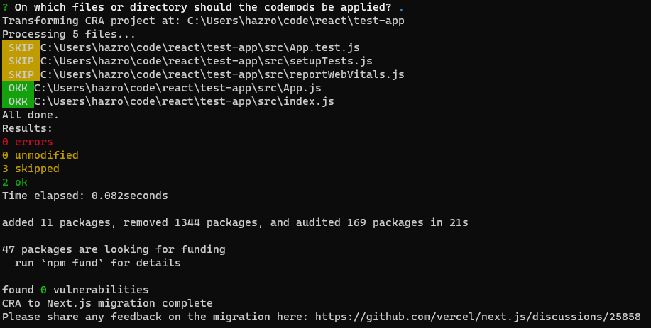
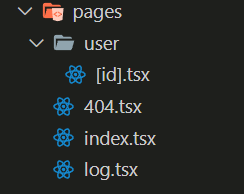

While React is great for developing high-quality web apps, Next.js offers a wide range of features that React doesn't have, like static site generation (SSG), server-side rendering (SSR) and API routes.  

<!--endintro-->

## Codemod 

A great automated way to migrate your create-react-app site to Next.js is by using the `@next/codemod` tool.

```shell
npx @next/codemod cra-to-next
```



This tool is a great starting point, but make sure to check all intended functionality has been ported correctly. 

## Data Fetching

It is also important to understand that when moving over the client-side functionality of the React app, it will not be using any of the powerful server-side Next.js features. If you can find parts of your application that can be moved to `getServerSideProps` or `getStaticProps`, make sure to manually add this functionality.  

## Routing

It is important to keep in mind that Next.js uses file-based routing, so there must be additional care in migrating React applications that use `react-router` or `react-router-dom`. While these libraries will still function as intended in Next.js by running this code on the client, many of the advantages of using Next's file-based routing will not be realised. 

::: bad

:::

::: good

:::

By using the `[id].tsx`, we can create a [dynamic route](https://nextjs.org/docs/pages/building-your-application/routing/dynamic-routes), where the ID can be accessed via props. This can then be used by either client-side React code or the Next.js specific server-side functions `getStaticProps` and `getSeverSideProps` to fetch data based on the request URL.  


