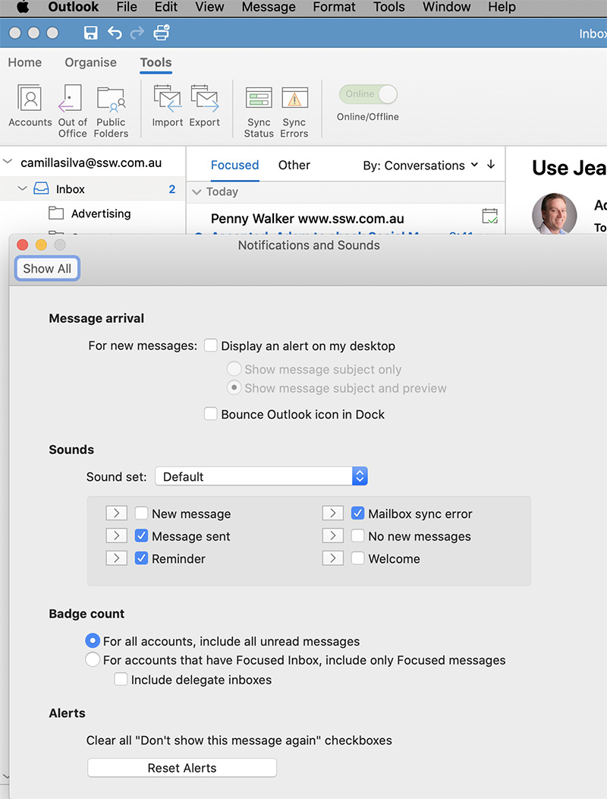

Getting in the zone is pretty challenging in any work environment. Outlook in particular likes to offer as many distractions as possible to ensure you can never forget you've got it open. Set your options so that Outlook:

<!--endintro-->

::: good  
  
:::

::: good  
  
:::

- Doesn't play a sound
- Doesn't briefly change the mouse cursor
- Doesn't show an envelope
- and DOESN'T display a New Mail Desktop Alert

Here are a few more distractions tips:

- [Minimize Teams distractions](/do-you-minimize-team-distractions)
- [Minimize Skype distractions](/minimize-skype-distractions)
- [General working environment distractions](/do-you-deal-with-distractions)
- [Turn off email notifications on Gmail](https://support.google.com/mail/answer/1075549)
