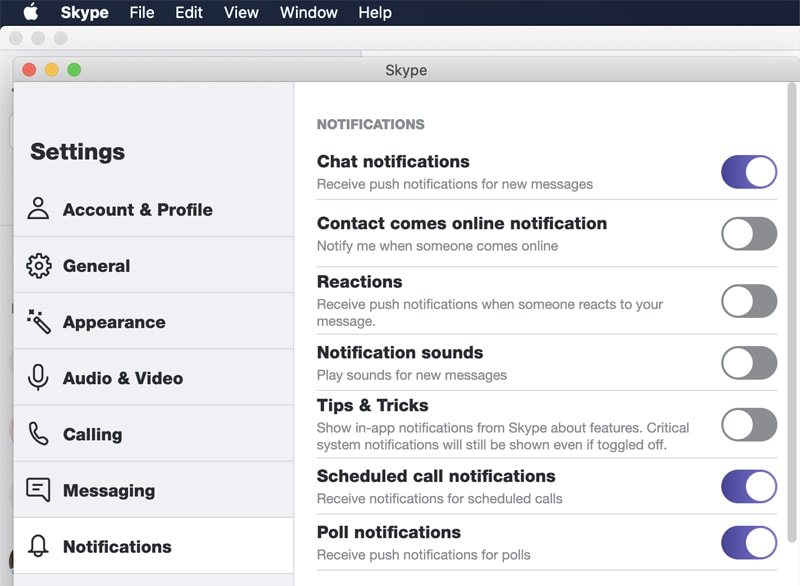

[Dealing with distractions](/do-you-deal-with-distractions) is a fundamental rule to a successful project. Skype is a great way to get distracted. Following these options helps you to minimize messaging/communication distractions: 

<!--endintro-->

1. Set your status to Busy - people will think twice before messaging you
2. Don't display an alert when a contact comes online or goes offline
3. Don't play a sound when you receive an email. Remember - you do need a sound when you receive an IM in case you're not looking at your PC when it arrives.

  
