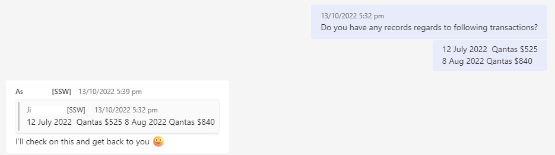
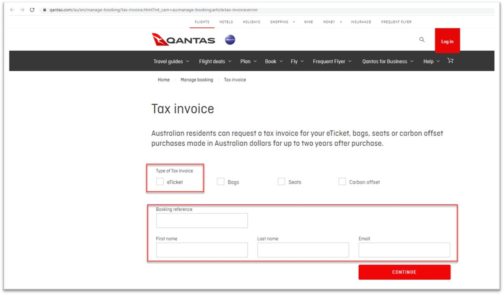

When booking a flight for a business trip, it is common for accountants to claim that as an expense. In that case, they will need the invoice for the trip.

In most cases, the tax invoices of the flights that booked by company were sent to the person.

The traditional way of retrieving the invoice is for the person who took the flight to send through the invoice directly. However, sometimes the person who needs to send through the invoice is too busy and unable to action this task for a long time or they may even forget to do it entirely.

::: bad

:::

Luckily, most airlines offers a convenient portal for managing bookings where you can retrieve this information for all company flights, e.g. [Qantas Business Rewards](https://www.qantas.com/au/en/business-rewards/qbr/myaccount)

Qantas offers a robust loyalty program, [take advantage of it](/do-you-take-advantage-of-business-rewards-programs).

* All flights booked by the company can be managed through [Qantas Business Rewards](https://www.qantas.com/au/en/business-rewards/qbr/myaccount)
* There is a [monthly report](https://www.qantas.com/au/en/business-rewards/qbr/reports) which can be downloaded

If an invoice is missing, you can access the document by:

Going to [Qantas Business Reward | Manage Booking](https://www.qantas.com/au/en/business-rewards/qbr/manage-bookings?lphnt=true), choose "Request tax invoice", tick “e-Ticket” and enter the booking reference which can be found on monthly reports or confirmation emails. Tax invoice will be sent to the email entered.

::: good 

:::

Simply retrieve the missed invoices from that portal and you can skip the middle man!

::: greybox
**Note:** Only bookings with company name and ABN can be managed through Qantas Business Rewards.
:::
