Designing your API up front can be very useful where you have a significant amount of backend development to complete before there is sufficient functionality for front end development to easily commence.

<!--endintro-->

Rather than waiting for the backend to be complete, the APIs can be agreed on up front. Tools like Azure API Management then allow you to mock up the APIs with sample data, allowing the front end development to commence much sooner.

The key benefit of using mocked APIs is being able to present the frontend to stakeholders for feedback really early.

First, watch the first 5 minutes of this video for a general introduction:

`youtube: https://youtu.be/4fPRxveXGXw`

Watch Adam Cogan and William Liebenberg discuss the benefits:

`youtube: https://youtu.be/rNyOALskc_U`

## Steps to create and test a mocked API endpoint

To complete the following steps, you need to create an instance of Azure API Management in your subscription.

> TIP: If you have Azure Credits, the Developer (NO SLA) edition is the cheapest option to test most of the features offered by API Management.

### Step 1 - Create Blank API

1. Select **Blank API**

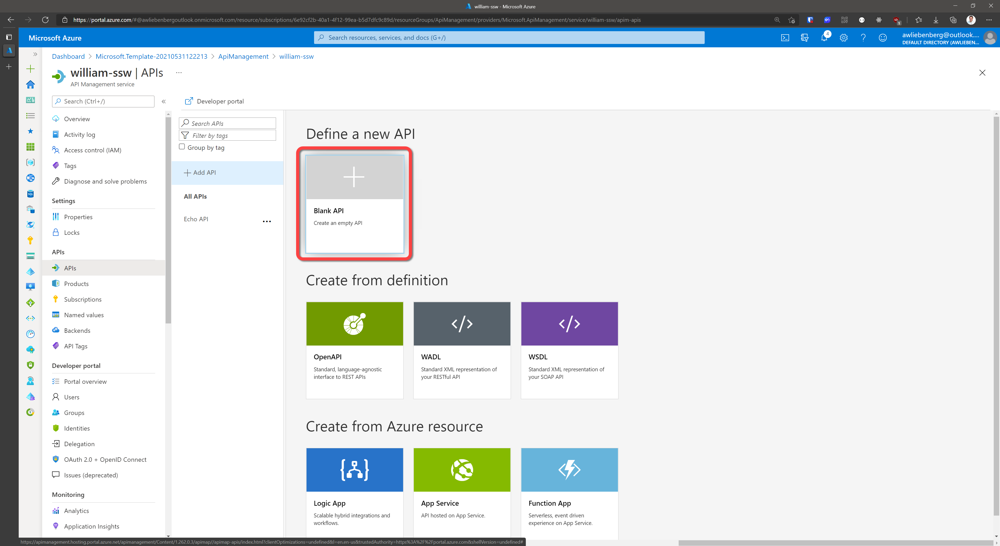

### Step 2 - Describe your API

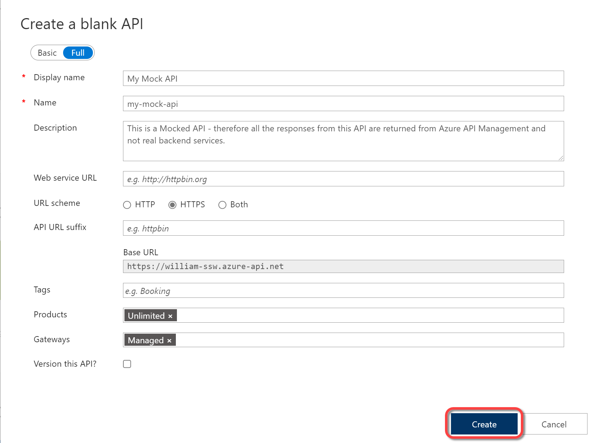

1. Click **Create**

### Step 3 - Add an Operation

1. Select your API from the API list
2. Click **Add operation**
3. Specify the Display name, Name and URL of your operation 
  - **Display name** is a UI friendly display name that shows up in the Operations list
  - **Name** is the programatic name of the operation that can be referenced programatically in policies

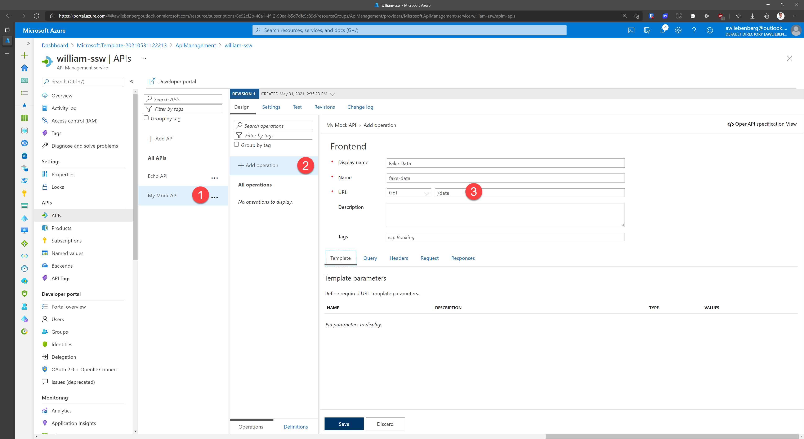

### Step 4 - Add response

1. Click **Add response**
2. Select the appropriate response code (e.g 200 OK)

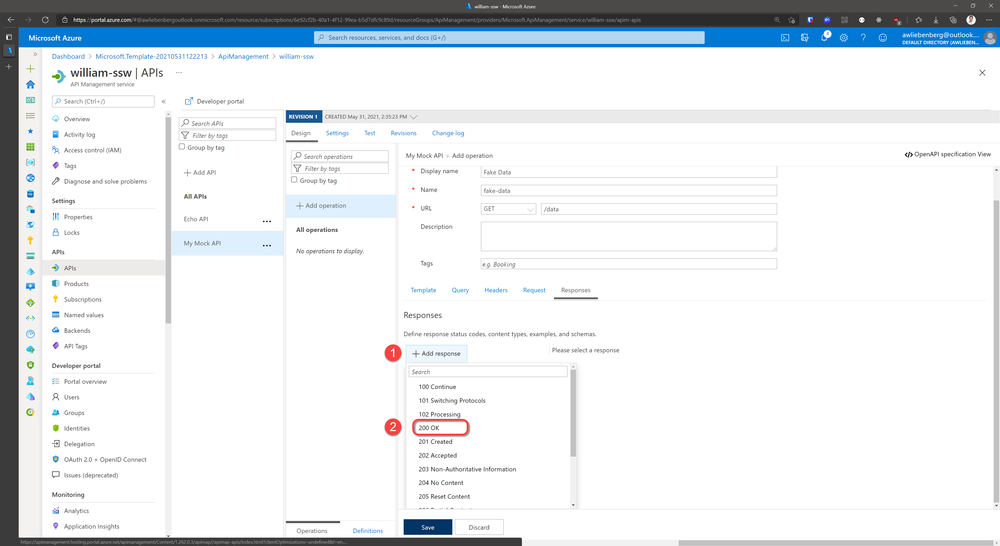

### Step 5 - Add representation

1. Specify the **Content Type** as `application/json`
2. Specify the **Sample** as `{ "data": "fake" }`
3. Click **Save**
  
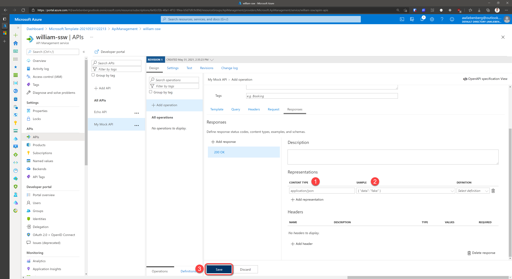

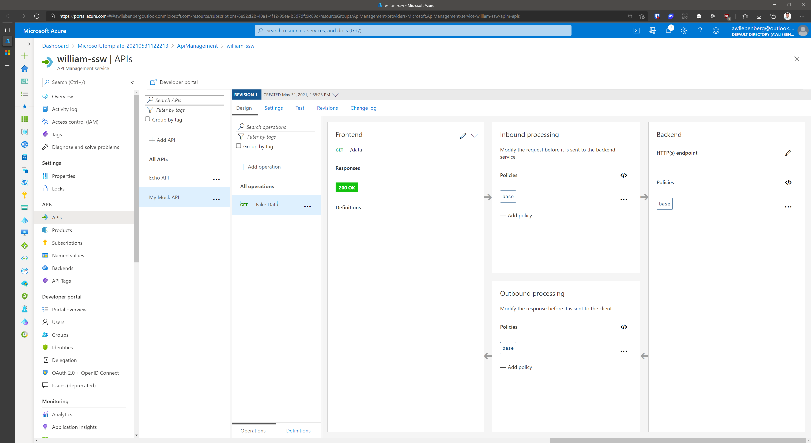

### Step 6 - Add Mock Response Policy

1. Click **Add policy**
2. Select **Mock responses**

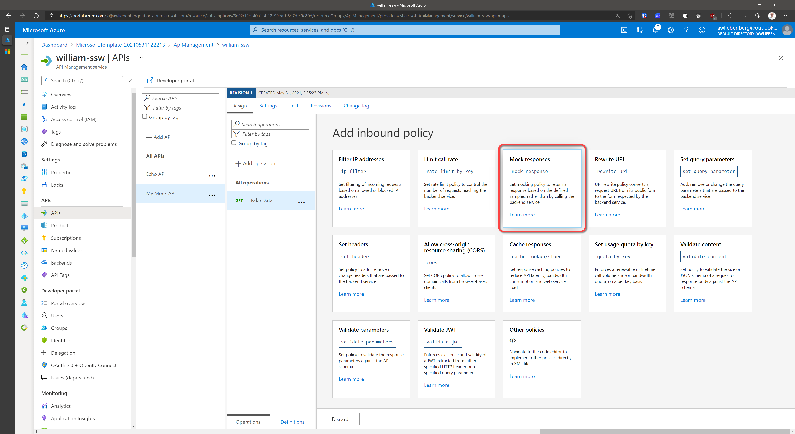

### Step 7 - Choose response

1. Choose the response representation to return as a Mock (e.g. `200 OK, application/json`)
2. Click **Save**

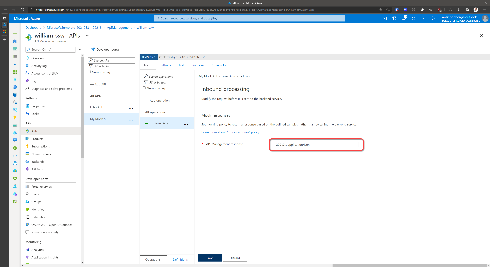

### Step 8 - Test your Mocked API

1. Make sure your API is selected
2. Click the **Test** tab
3. Click the FakeData operation
4. Note the "Mocking is enabled" notice
5. Click **Send**

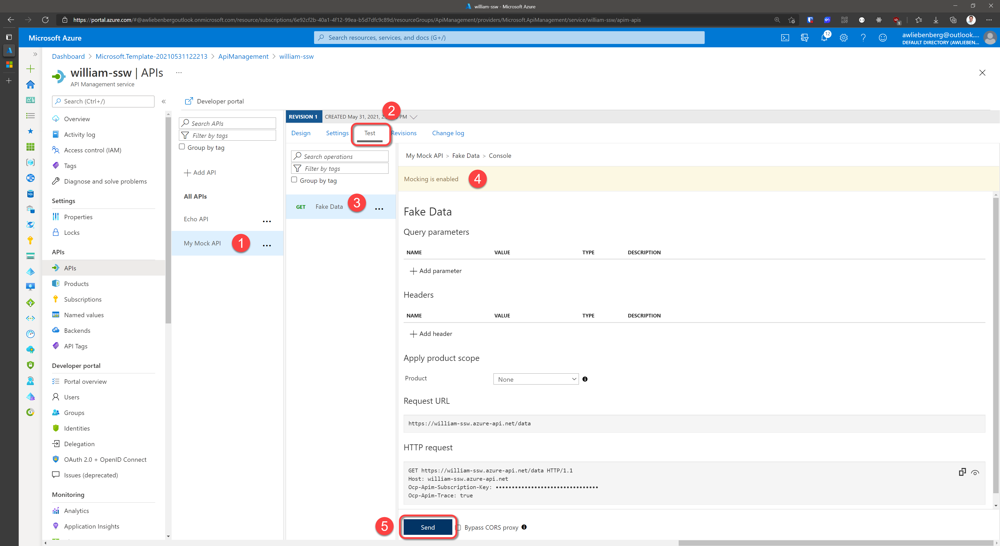

### Step 9 - Inspect Mocked API response

1. Notice the 200 OK status code
2. Notice the fake data response in the message body

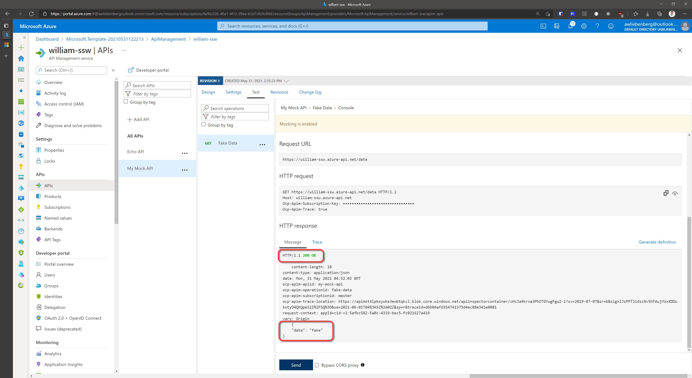

### Step 10 - Call your API using a REST Client

1. Add a new `GET` request to your REST Client
2. Specify the API Uri such as `https://william-ssw.azure-api.net/data`
3. Add the subscription header `Ocp-Apim-Subscription-Key` and value
     - you can copy the value directly from the operation HTTP Request section
     - or, from the API Management service | Subscriptions blade
4. **SEND** your request
5. Verify the `200 OK` response and the mocked data

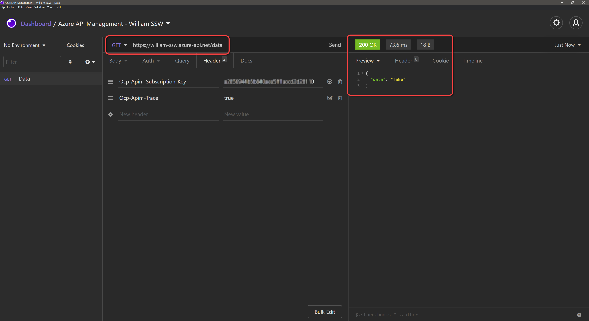

## Conclusion

Mocking API responses is awesome! You are able to quickly add mocked responses for all your API endpoints without even having a real backend implementation, and your front-end application can make REAL API calls. 
