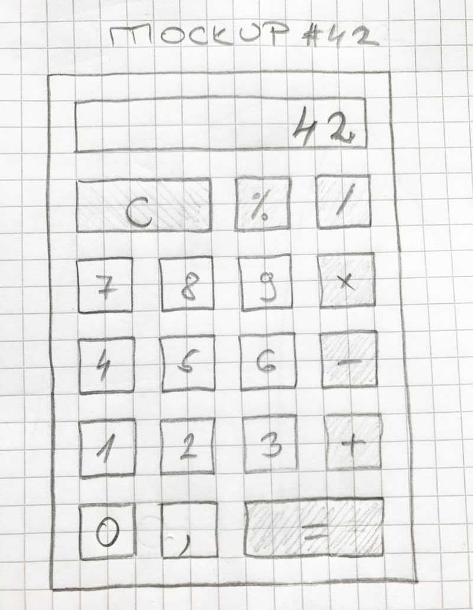
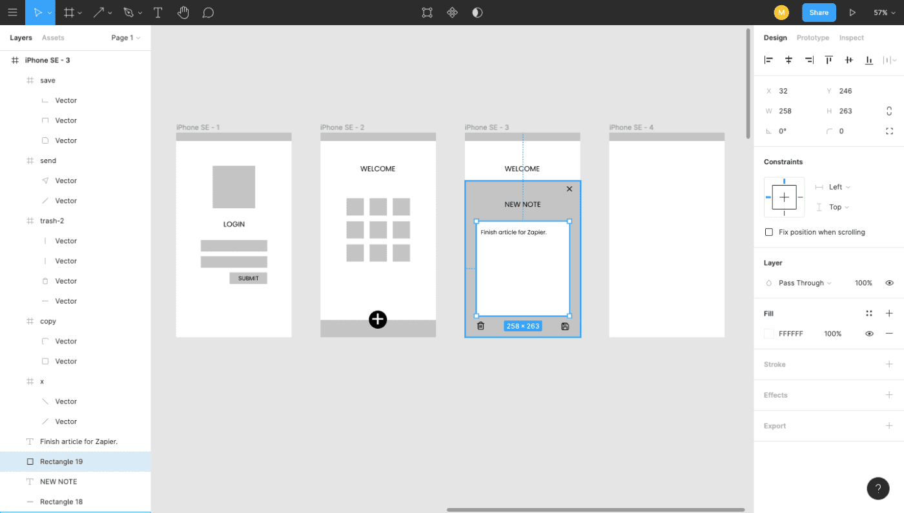
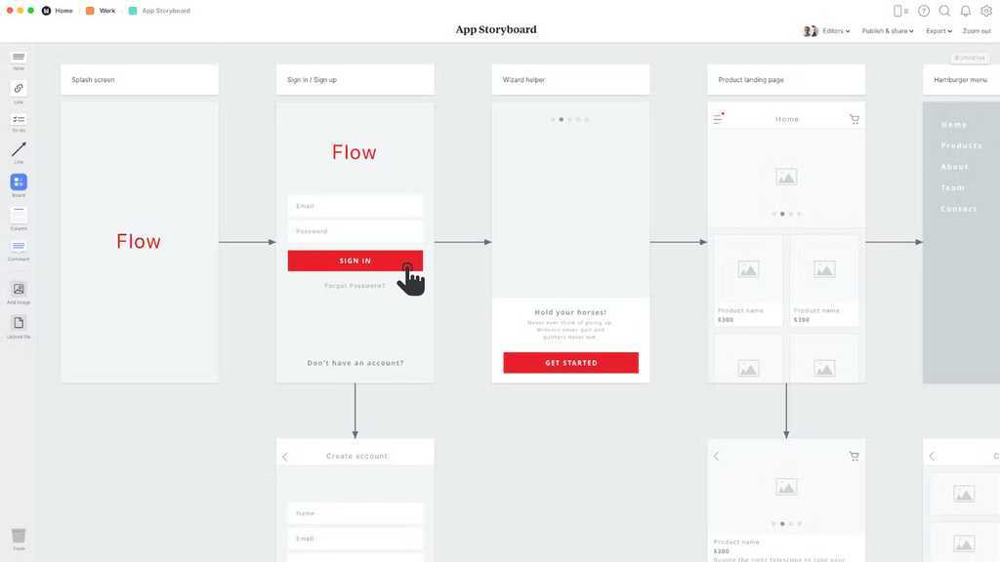
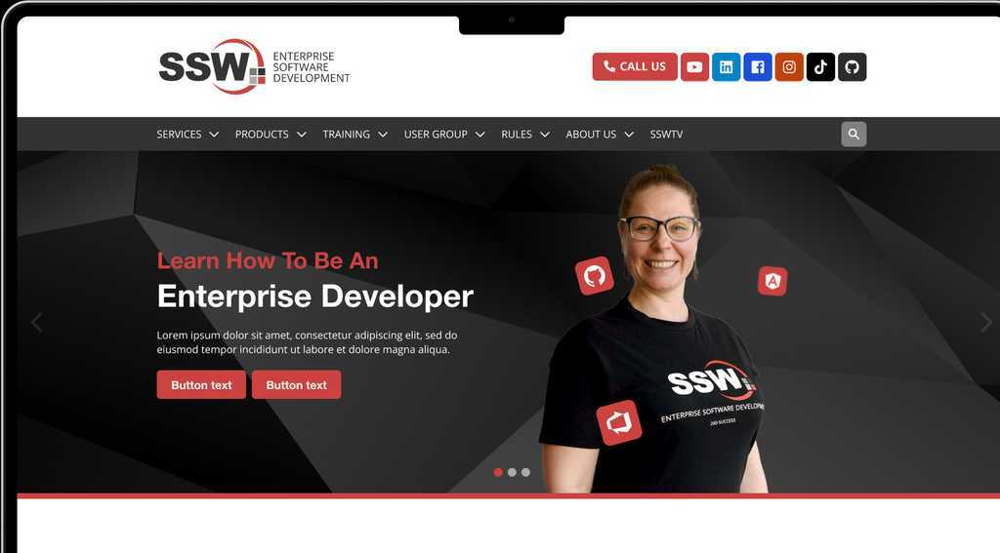

Many user requirements can be best encapsulated in visual mockups. A design mockup is a visual representation that illustrates the layout, structure, and content of a product or interface before it is developed. A mockup can become a prototype over time but they tend to come earlier in the design process and are static images rather than interactive testing tools.

<!--endintro-->

There are 3 levels of mockups:

1. **Low-fidelity Mockups** 
2. **High-fidelity Mockups** (recommended)
3. **Interactive Prototypes**

Often it's best to start with a low-fidelity mockup to get across a concept or rough storyboard. Then complete a high-fidelity mockup to communicate the look and feel, and if time permits create an interactive prototype.

### Low-fidelity Mockups

Creating a low-fidelity design mockup can be achieved through various methods including wireframes, paper prototypes, and other similar techniques. It can be valuable to have the product owner on call when creating a low-fidelity mockup to get immediate feedback and direction.

Start by identifying the key features and functionality that the product should have. This will help you focus your efforts and ensure that your mockup accurately represents your intended product.

::: img-large

:::

Then create a basic wireframe of your design. A wireframe is a visual representation of the layout and structure of your website or app. You can create digital wireframes using tools like Figma, Adobe XD, or Sketch. Alternatively, you can use paper and pencil to sketch out a rough wireframe by hand. Add details to your wireframe by adding boxes and labels for different features and elements (e.g. buttons, input fields, and images). 

::: good

:::

Once your low-fidelity design mockup has been approved, you can use it as a reference point for creating a high-fidelity mockup. 

### High-fidelity Mockups

A high-fidelity mockup is a more detailed version of a design that includes visual design elements such as typography, colors, and images. It is created using specialized design tools and takes more time to create than a low-fidelity mockup.

::: greybox
**Warning:** Don't go down the track of giving a customer a few concepts (on some projects we gave 2 or 3 completely different concepts by different designers). This leads to too much mixing and matching when they see them. 
:::

::: good

:::

Use a design tool such as Figma to create high-fidelity mockups of a website or app's interface. This should include more consideration of UX and detailed UI elements such as buttons, forms, icons, and typography.

::: greybox
**Incorporate branding:** It's important to incorporate the brand's visual identity into the design of a product! This should include the brand's given color scheme, typography, and logo at a minimum.
:::

::: good

:::

### Interactive Fidelity

To make a mockup more realistic and accurate to the end product, add interactivity to it. This includes consideration of how different elements will respond to user input, such as on-hover effects or the styling of visited links.

`youtube: https://www.youtube.com/embed/-d6zNGeF59M`

### Tools

* [Figma](https://www.figma.com) (Recommended)
* [Sketch](https://www.sketchapp.com) (Mac Only and for UX designers)
* [Moqups](https://moqups.com) (HTML5 based App)
* [UXPin](http://uxpin.com) (more sophisticated, helps you create responsive designs)

### Summary

Mockups help create more clarity than bulky design documents.

For example, to communicate that “a customer has many phone numbers”, a storyboard/wireframe of how that relationship will appear in the user interface is much more likely to be understood by the client.

Clear communication of the message is more important than the medium used to convey that message.

::: greybox

Here are some more hot tips on using mockups for specification analysis:

* It is best to have a designer, developer, and customer work together
* Mock-ups should follow [interface rules](/rules-to-better-interfaces-general-usability-practices)
* Get the mockups [physically initialed](/tasks-do-you-know-to-ensure-that-relevant-emails-are-attached-to-tasks), especially if you are performing a fixed-price contract. Yes, paperless is great - but not in this case
* If you can't get mockups initialed, then page by page approval over email is the 2nd best option
* Write the related business rules at the bottom of each screen - to be turned into unit tests

:::