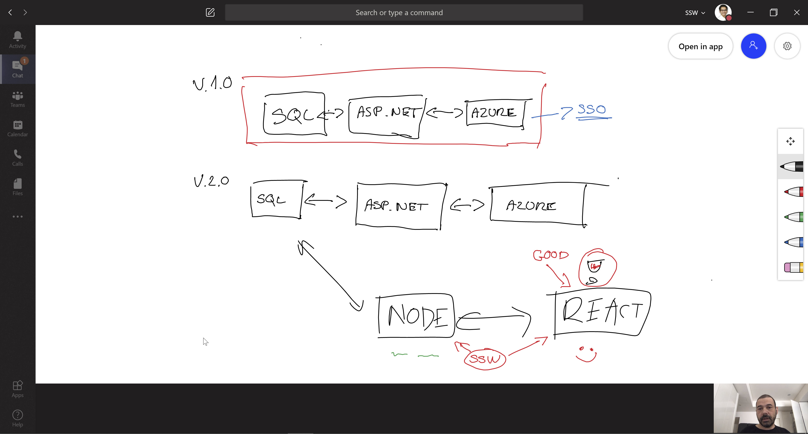
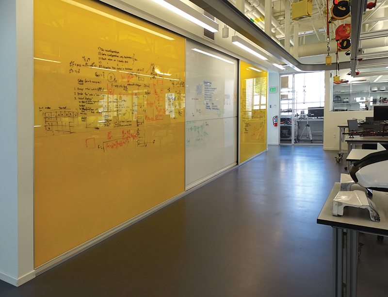

​​​​​A great way of collaborating with a team or presenting a new solution to a client is using a visual display of your recommendations. 

Using a whiteboard is a great way of collaborating and brainstorming which works quite well. But a physical whiteboard is a large ugly object that takes up a fair amount of room, often isn’t kept clean, and doesn’t allow for people to collaborate remotely. There are modern alternatives that work even better, let's have a look at them.  

Software consultants often use architecture diagrams to present a solution to the client. These graphical representations are used to help all of the stakeholders, the developers, the designers, and the clients visualize the high-level structure of the system or application to ensure it covers all of the client requirements.  
<dl class="badImage"><dt> 
       
   </dt><dd>Figure: Bad example - When working with people online, drawing on some paper, taking a photo, and emailing it… is the *least* collaborative way to work​​ </dd></dl><dl class="image"><dt>
       
   </dt><dd>Figure: OK example - Teams Whiteboard is a good collaborating tool while working online.​ (Using a mouse is not pleasant, and a computer pen is not really natural for complex diagrams 🔥) </dd></dl><dl class="goodImage"><dt> 
       
   </dt><dd>Figure: Good example - An architecture diagram exists on established projects after many discussions​ </dd></dl>
 <excerpt class='endintro'></excerpt> 
<h3 class="ssw15-rteElement-H3">​#1 Laptop and cast to a monitor (recommended) ⭐️  </h3>
Using your laptop or Ipad and then sharing your screen in a remote meeting and is easily saveable/sharable for later. There are many apps that allow you to sketch what you're talking about e.g.: 
<ul><li>PowerPoint</li><li>Visio </li><li>OneNote </li><li> 
      <a href="https://mural.co/" class="md-opjjpmhoiojifppkkcdabiobhakljdgm_doc">Mural</a> (collaborative app) </li><li>Microsoft Teams Whiteboard​​​​​​​</li><li>Microsoft Whiteboard</li><li>diagrams.net ​(was draw.io) ⭐️ - often collaborative sketches generated above enable the creation​ of a beautiful architecture diagram​​​​​ (<a href=/do-you-review-the-documentation>Do you make awesome documentation?​</a>) </li></ul>
<b>Note: </b>these work fine with a mouse, they work even better with touch screens, or pens/styluses 

<dl class="image">
      <dt> 
        
      </dt><dd>Figure: Pens/Styluses help to draw better sketches​​ </dd></dl>
<dl class="image"><dt>
 
         <iframe width="750" height="390" src="https://www.youtube.com/embed/qDqtWRu0rTA" frameborder="0"></iframe>
           
​​​​</dt><dd> Figure: Using Whiteboard in Microsoft Teams​ </dd></dl><dl class="image"><dt>
 
         <iframe width="750" height="390" src="https://www.youtube.com/embed/JsaqPiqBxPY" frameborder="0"></iframe>
           
​​​​</dt><dd> Figure: Using Microsoft Whiteboard App​​ </dd></dl> ​​#2 Tech Whiteboard replacement 
<ul><li> 
      <b>Samsung Flip</b> ($3k AUD)  
      <dl class="image"><dt>
 
               <iframe width="750" height="390" src="https://www.youtube.com/embed/lZgVAbdwYNI" frameborder="0"></iframe>
                 
​​​​</dt><dd> Figure: Using Samsung Flip​ </dd></dl><dl class="image"><dt> 
             
         </dt><dd>​​​Figure: Samsung Flip can be flipped from horizontal to vertical​​​ </dd></dl></li><li> 
      <b>Microsoft Surface Hub 2</b> (about $12K AUD)  
      <dl class="image"><dt>
 
               <iframe width="750" height="390" src="https://www.youtube.com/embed/GSUHgrjwBb4" frameborder="0"></iframe> 
</dt><dd>Figure: Using Microsoft Surface Hub​ </dd></dl></li></ul><h3 class="ssw15-rteElement-H3">#3 Paper Whiteboard (Low tech – a large piece of paper) </h3>
Old school but it is great to have a pen in hand, you can always just grab a big piece of paper and draw on it together. 

Bear in mind that paper is not ideal because you can’t wipe it out... you have to start again #ouch 
<dl class="image"><dt> 
       
        
   </dt><dd>Figure: Paper whiteboards don't work when someone is in Sydney and the other attendee​​ is in Melbourne</dd></dl>

<h3 class="ssw15-rteElement-H3">#4 Whiteboard and marker - Low tech (ugly)  </h3>
The traditional whiteboard. 

Quote from Adam Cogan (apparently not a fan of whiteboards in a tech office): 

I believe whiteboards are a sign of an old office… and they are ugly. They’re not a sign of a modern office. Sometimes they are useful and I know some people really like them (generally older people). I have seen the digital whiteboards (usually targeted at teachers) but I think they are horrible to use. The common scenario is for a spec review. I am always happy when I see devs using their device and casting to the TV. And the subsequent notes get saved to Microsoft Teams.
<dl class="image"><dt> 
       
        
   </dt><dd>Figure: Whiteboards are not a sign of a modern office.​ </dd></dl><h3 class="ssw15-rteElement-H3">#5 Writable wall -  Low tech (ugly) </h3>
Low tech (ugly) – Paint a wall to be writable or put some writable film on an office glass wall
<dl class="image"><dt>
      
   </dt><dd>Figure: Writable walls can be dirty even after cleaning up​ ​</dd></dl>

