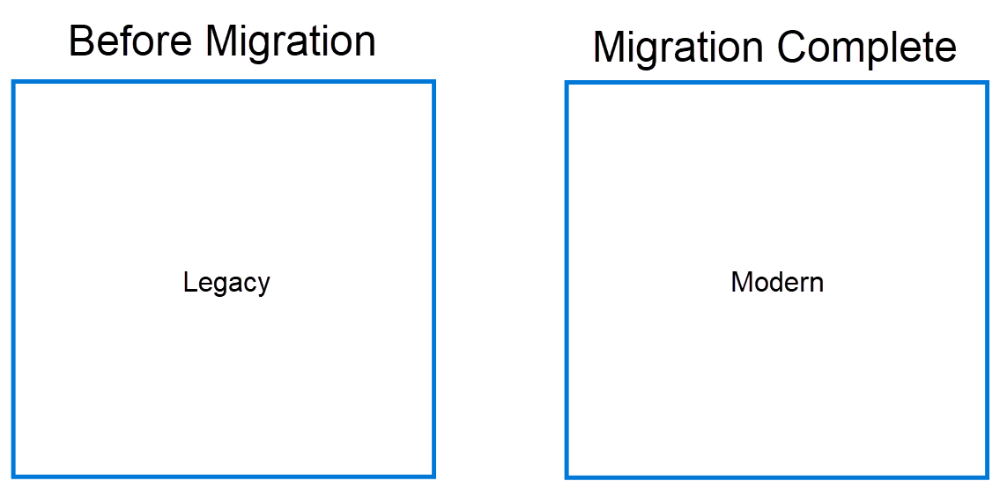
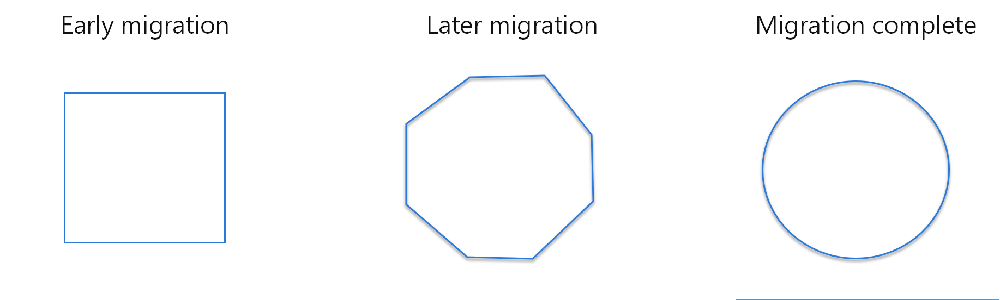

The need to add new features and functionality to legacy systems is always present - over time it can become continually harder to do this. Additionally, these systems are often built using old tools, SDKs, hosted on outdated platforms, or potentially have increasingly complex (or obsolete) architectures - these all contribute to make is harder to maintain the systems in the first place.

At some point, it becomes necessary to take the existing legacy system and update it to a more modern architecture using newer tools and technologies.

Without focusing on the specific technology - there are 3 main approaches to modernizing applications:

<!--endintro-->

1. Big Bang (aka Rewrite)
2. Evolutionary
3. Strangler fig pattern

`youtube: https://www.youtube.com/embed/XQyCgwB_szI`
**Figure: Migrate Your Legacy ASP.NET Projects to ASP.NET Core Incrementally with YARP (36:45)**

## Big Bang (aka Rewrite)

Lock the developers into a room and shove some pizza under the door... and don't let them out until the application is modernized! Whilst this is a bit of a joke, it is a valid approach to modernizing applications. The idea is to take the existing application and rewrite it from scratch using the latest technologies and tools. This is a valid approach if you have a small application that is not complex and you have the time and budget to do this.

### ✅ Pros

* Easy to plan
* It all gets done in one hit

### ❌ Cons

* It is still a big task, and you have re-test the entire application to ensure that the changes have not broken anything.
* Once live, there is no quick rollback strategy if something goes wrong.
* BAU work must stop whilst this is happening.
* This is not a realistic approach for most enterprise applications.

::: ok  

:::

## Evolutionary

The idea is to take the existing application and incrementally update it to a more modern architecture. This is a better approach if you have a large application that is complex and you have the time and budget to do this.

### ✅ Pros

* BAU development can continue on the old application.
* You can choose the speed of the evolution - you can do it quickly or slowly, reinspecting the application at each step.

### ❌ Cons

* Can feel like yak shaving - you can end up spending a lot of time on the migration and not actually modernizing the application.
* It is still a big task, and you generally have re-test large parts of the application to ensure that the changes have not broken anything.
* There is no quick rollback strategy if something goes wrong.
* At some point you'll hit a point where there needs to be a Big Bang change to get it over the line - this is not a realistic approach for most applications.

::: ok  

:::

## Strangler fig pattern (recommended)

[Strangler Fig pattern was first described by Martin Fowler in 2004](https://martinfowler.com/bliki/StranglerFigApplication.html). The strangler fig is a type of tree that grows around other trees and slowly kills them by strangling them. This is exactly what this pattern does.

::: no-border

:::

The idea is to create a "new" application (with a modern architecture) that acts as a facade to the existing application - then port features bit by bit to the new/modern architecture. Once slices of functionality have been ported and are ready - re-point the facade to execute the new code. You can trigger this through feature flags and this also allows you to rollback to the old code if something goes wrong.

::: tip
Looking to incrementally update an ASP.NET application? Read about using [YARP](https://microsoft.github.io/reverse-proxy/) and [Incremental ASP.NET to ASP.NET Core Migration](https://devblogs.microsoft.com/dotnet/incremental-asp-net-to-asp-net-core-migration/)
:::

It's a language & platform agnostic approach that can be applied to any application.

Microsoft have a great article on the strangler fig pattern - [Strangler Fig Application](https://docs.microsoft.com/en-us/azure/architecture/patterns/strangler-fig).

It works for AWS too - [Strangler Fig Application](https://docs.aws.amazon.com/prescriptive-guidance/latest/modernization-aspnet-web-services/fig-pattern.html).

### ✅ Pros

* You can roll-back (re-point) to the old application if something goes wrong.
* You can test the new application in isolation.
* You can test the new application in parallel with the old application and confirm that the new application is working as expected.
* BAU development can continue on the old application.

### ❌ Cons

* Not be suitable for all applications - especially when you cannot intercept calls to the back-end system being replaced
* Not for smaller/non-complex systems.

::: good  

:::

::: info  
Tip: this pattern can be used when migrating websites to a new architecture. You can place Azure Front Door in front of the existing website. Once a page (or route) on the new website is ready - you can re-point that page in Front Door to the new website.
:::

## Customer success story

Campion was able to move from a monolithic application to microservices whilst still continually deploying code to production by leveraging the Strangler Fig pattern. Watch at 28:00

`youtube: https://youtu.be/TNTqd0vhalY?t=1679`
**Figure: Education in the Cloud – Campion's Digital Journey with Alexander Candy-Levy (1:07:46)**
