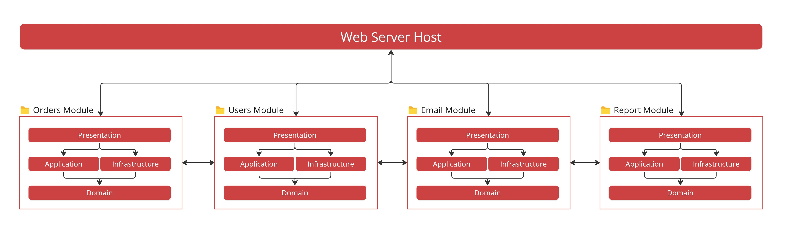

> The Modular Monolith architecture is the “goldilocks” approach that combines the modularity of microservices with the simplicity of traditional Monoliths
> - Steve “Ardalis” Smith

<!--endintro-->

## What is a Modular Monolith?

- Single Host/Process
- Single Deployment
- Loosely coupled modules that each have their own
  - Domain
  - Application
  - Infrastructure
  - Presentation (API or UI)
- Each module represents a business capability or domain
- Each module should be as highly cohesive and loosely coupled with other modules
- Each module manages it's on data and persistence

### ✅ Advantages

- **Simplicity in Deployment**: Since it's a monolith, the deployment is typically simpler than distributed systems like microservices
- **Ease of Development**: Developers can work on separate modules without significantly affecting other parts of the application
- **Performance**: Inter-module communication is often faster and more reliable than inter-service communication in distributed architectures

### ❌ Challenges

- **Scalability**: While more scalable than a traditional monolith, it may not scale as effectively as microservices

- **Modular Discipline**: Maintaining strict modularity can be challenging as the application grows and evolves

A Modular Monolith offers a balance between the simplicity and coherence of a monolith and the modularity and maintainability of more distributed architectures. It is particularly useful for certain kinds of applications and organizational contexts. 

## How does a Modular Monolith compare to other architectures

| Trade-Offs | Layered / CA | Microservices | Modular Monolith |
| -------- | -------- | -------- | -------- |
| Modularity     | ❌     | ✅     | ✅     |
| Cost     | $     | $$$     | $     |
| Scalability     | ❌     | ✅     | ❌     |
| Simplicity     | ✅     | ❌     | ✅     |

