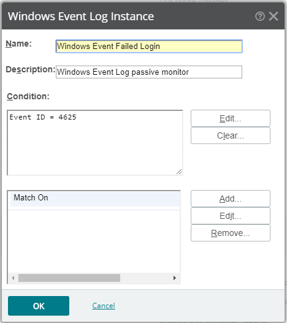
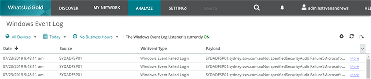

It is important to monitor failed log in attempts to determine if you are being attacked from an external source or are having failed attempts from users within your organization. This can be achieved with **Passive Whats Up Gold Monitor**.

<!--endintro-->

  

::: good  
  
:::

It is important to also ensure that you have "Audit log on events" Group Policy applied to servers for source information on the login. 

See: [Do you use Group Policy to enable auditing of log on attempts?](/use-group-policy-to-enable-auditing-of-logon-attempts)
