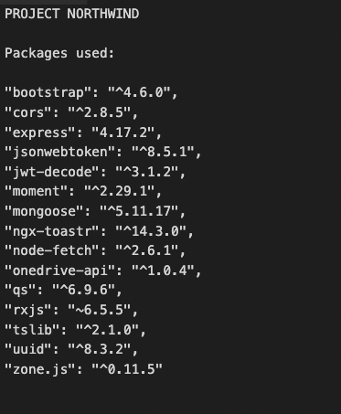
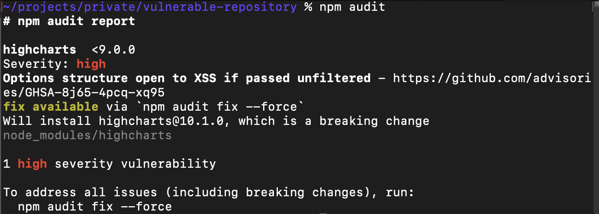
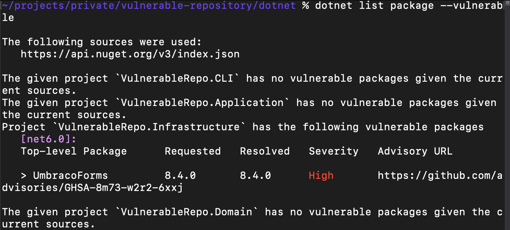
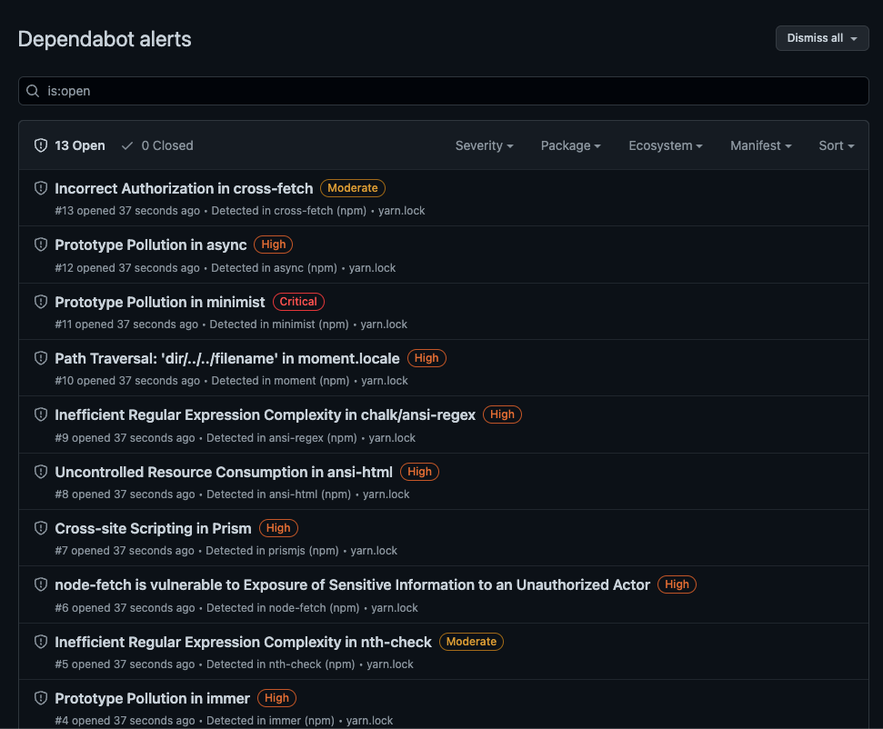
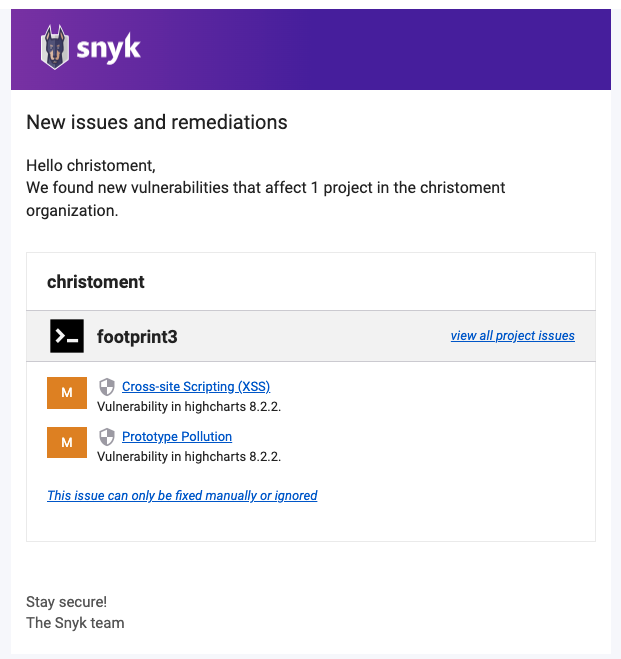

Efficient software developers don't reinvent the wheel and know the right packages to use when monitoring vulnerabilities in both frontend and backend packages.
🔐 Using a bunch of third-party libraries as the supporting building blocks to build modern, high-quality applications became a common practice since they save time and money in full-stack projects.

But this comes with an unexpected side effect: out-of-date packages that must be updated and re-tested, and even worse, vulnerabilities can be introduced!

One of the big challenges for developers to address is when a project has been delivered to a client and gone into maintenance mode. With no developer actively working on the project, if a vulnerability is discovered in a library referenced in the project, no one will be aware of it, and it will cause pain.

However, if you monitor the packages you have installed, and a vulnerability is reported, then as developers, we have a duty of care to inform our clients.

### Level 0 - Manual tracking

List all installed packages in a file and cross-check with the [advisory board](https://github.com/advisories) and Google it, and change each lines regularly. Not recommended because this consumes time.

::: bad

:::

### Level 1 - Using tools to scan for vulnerabilities

Modern package managers such as npm or NuGet offers a way to check for vulnerabilities in the installed libraries. See [Do you keep your npm and yarn packages up to date?](/packages-up-to-date)

* npm: `npm audit`
* yarn: `yarn audit`
* dotnet cli: `dotnet list package --vulnerable`

Regularly running this command can give a summarised report on known vulnerabilities in the referenced libraries.

This is an improvement over manual tracking but still requires a developer to check out the latest code and then run the command.

::: ok

:::

::: ok

:::

### Level 2 - Automate vulnerability scanning (recommended)

Using 3rd party tools can help you to automate vulnerability scanning.

These tools will alert you whenever there's a security vulnerability detected in the project and optionally raise a PR for it.

Some of the available tools in the market:

* [Dependabot](https://github.com/dependabot) - free for all repositories under GitHub, easy to set up in the repository settings **(recommended)**. Used in [SSW Rules](https://www.ssw.com.au/rules/)
* [GitHub Enterprise Advanced Security](https://github.com/enterprise) - $ includes Dependabot plus additional features [like code scanning](https://docs.github.com/en/code-security/getting-started/github-security-features#available-with-github-advanced-security). See [here](https://docs.github.com/en/enterprise-cloud@latest/get-started/learning-about-github/about-github-advanced-security) for more details.
* [Snyk](https://snyk.io/) - $
* [Sonatype](https://www.sonatype.com/) - $

::: good

:::

::: good

:::
