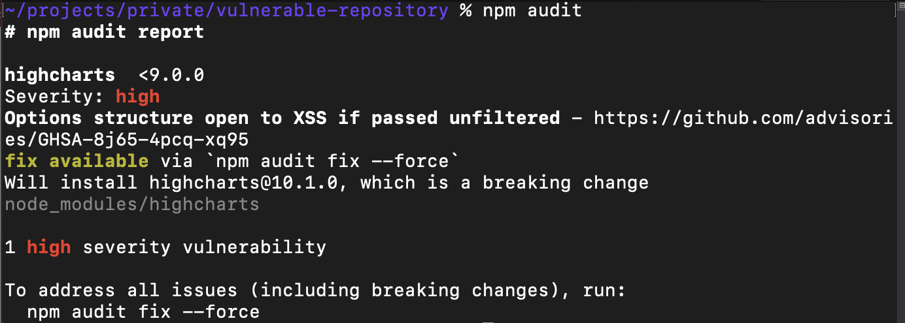
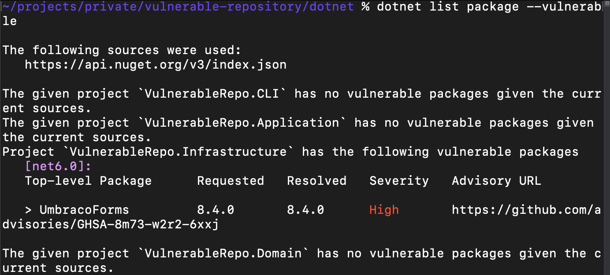
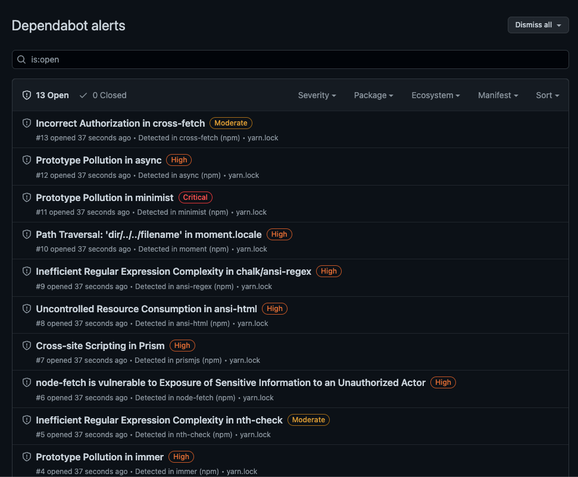
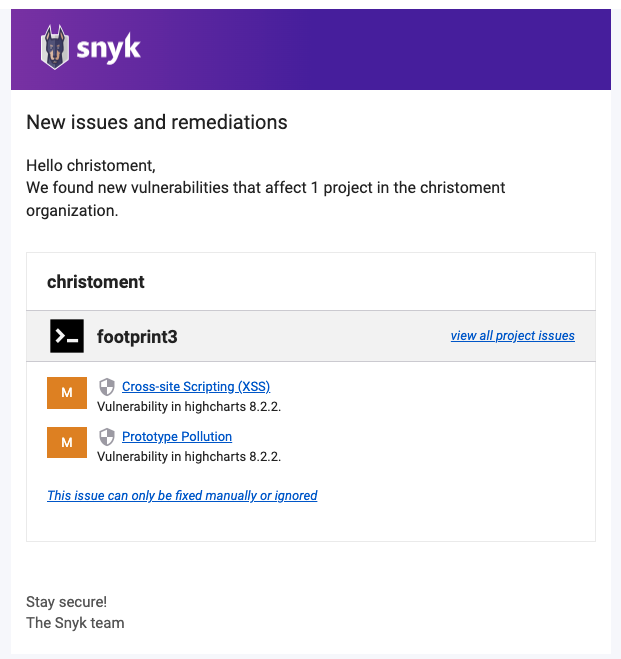

Using libraries as a building block for your project is a standard in modern software development. It's fairly normal to have 10+ npm and Nuget libraries used in a full-stack project.

One of the big challenges for developers to address is when this project has been delivered to the client and then gone to maintenance mode. With no developer actively working on the project, if there is a serious vulnerability discovered in library `northwind/azure-helper@1.2.3` that is in the project, no one will be aware of it, and it might cause some damage.

On the other hand, if you monitor the packages you have installed, you can notify the client, and it could score you extra brownie points and an opportunity for a follow-up client work.

## Level 0 - Manual tracking

List all installed packages in a file and cross-check with the news regularly. Not recommended because this consumes time.

::: bad

:::

## Level 1 - Using tools to scan for vulnerabilities

Modern package managers such as npm or Nuget offers a way to check for vulnerabilities in the installed libraries.

* npm: `npm audit` 
* nuget: `dotnet list package --vulnerable`

Regularly running this command can give a summarised report on known vulnerabilities installed in the project.

This is an improvement over manual tracking but still requires a developer to check out the latest code and then run the command.

::: good

:::

::: good

:::

## Level 2 - Automate vulnerability scanning (recommended)

Using 3rd party tools can help you to automate vulnerability scanning.

These tools will alert you whenever there's a security vulnerability detected in the project and optionally raise a PR for it.

Some of the available tools in the market:
- [Dependabot](https://github.com/dependabot) - free for all repositories under GitHub **(recommended)**
- [GitHub Enterprise](https://github.com/enterprise) - Includes Dependabot plus additional features like code scanning. See [here](https://docs.github.com/en/enterprise-cloud@latest/get-started/learning-about-github/about-github-advanced-security) for more details.
- [Snyk](https://snyk.io/)
- [Sonatype](https://www.sonatype.com/)

::: good

:::

::: good

:::
