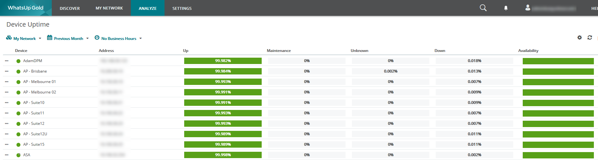
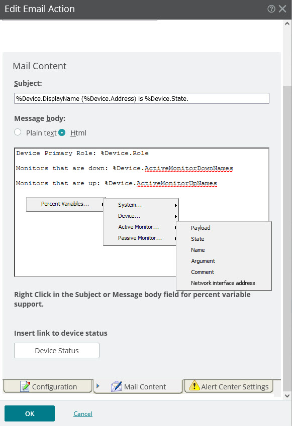
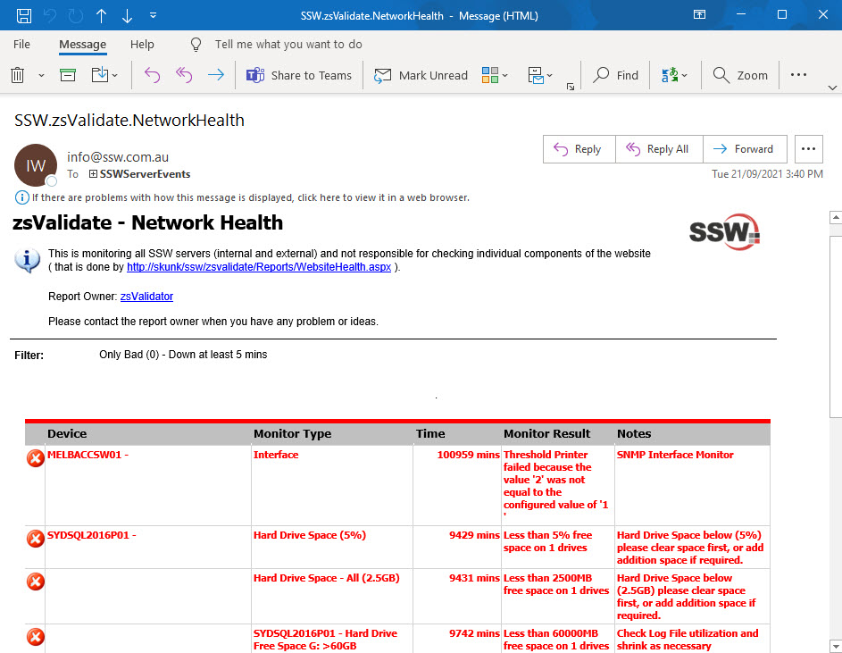

It is important that the system administrator can easily find out how reliable his servers are. This can be achieved using tools like What's Up Gold (WUG) https://www.whatsupgold.com to monitor many statistics e.g.:

* Uptime - Ping, Interface monitor
* Performance - RAM usage, CPU usage
* Network - Bandwidth, Interface throughput
* Storage - Disk usage, health

For example, here is a report in WhatsUp Gold you can use to monitor servers on a daily basis.

<!--endintro-->

::: good

:::

Another option is to use WUG's built-in email alerts, which can be formatted in HTML or plain text. You can also add variables that change based on the current state of devices and other stats.

::: good

:::

The best option is to use SQL Reporting Services to create a custom report that can be emailed via a data-driven subscription, which sends a nicely formatted email when there's a problem.

::: good

:::