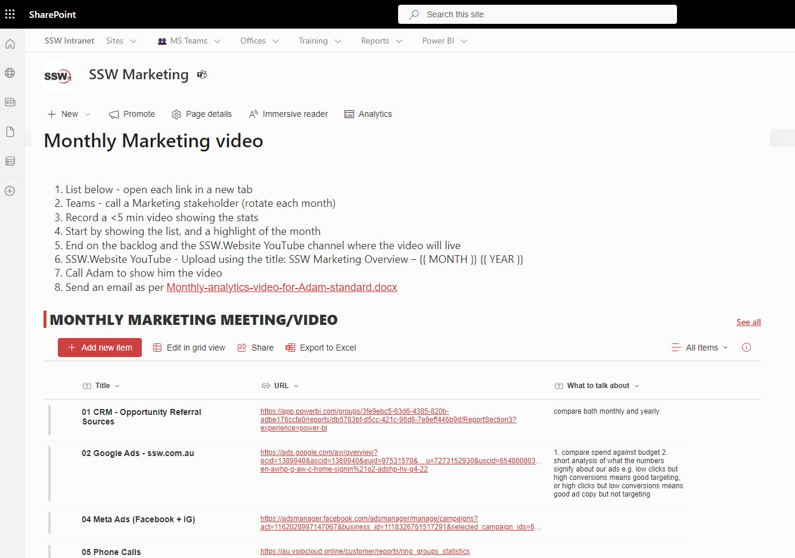

Keeping stakeholders up to date is crucial for the success of any project. Developer teams use [Scrum meetings](/scrum-master-do-you-schedule-the-3-meetings) which work very well. For internal admin teams - Scrum might not work as well (e.g. Sales, Accounting). Often admin teams get sidetracked or have tasks that are not definitively measurable, therefore Scrum isn't a perfect tracker of tasks or performance.

To keep stakeholders well informed, these teams should record a **monthly stakeholder video**. This ensures that stakeholders are aware of the project’s progress, any challenges faced, and the plans for the upcoming month. It also provides a personal touch - stakeholders get to hear from the team directly.

<!--endintro-->

::: info
For more detailed updates on completed work each Sprint, make sure you're also doing a [Sprint Review Summary Recording](/summary-recording-sprint-reviews) to show what’s been done and get PBIs accepted.
:::

## ✅ Benefits

* **Transparency** - Regular updates promote transparency and problems get resolved before they balloon
* **Engagement** - Videos are more engaging than written reports
* **Accessibility** -  Stakeholders can watch the video at their convenience, making it easier for them to stay informed without scheduling conflicts

To be consistent, have a recurring appointment each month:

::: email-template

| | |
| -------- | --- |
| Required Attendees: | {{ PERSON WITH THE EMPLOYEE RESPONSIBILITY }} |
| Optional Attendees: | {{ REST OF THE TEAM }} |
| Recurrence: | 1st Monday of each month |
| Subject: | Recording - Monthly {{ PROJECT NAME }} for {{ MONTH }} |

::: email-content

### Hi {{ PERSON WITH THE EMPLOYEE RESPONSIBILITY }}

Please record last month’s overview video.

1. Follow the instructions: {{ URL TO THE LIST OF REPORTS TO REVIEW }}
2. Try having {{ PRODUCT OWNER }} on the call – if not choose another relevant person

\< As per <https://ssw.com.au/rules/monthly-stakeholder-video> \>

:::
:::

## Creating an effective video

To ensure your video is clear and following best practices, read and follow [the key things for making a great 'Done Video'](/making-a-great-done-video/).

### Steps

The video should be recorded by the Product Owner (or other head of the team).

1. Open the relevant pages/analytics in browser tabs (this might be PowerBI for Sales, Google Ads and social media for Marketing, etc.)
2. Bring up the important points you will talk about
3. Record the video, clicking through the tabs and talking through the important metrics\
   **Tip:** Use [ZoomIt](https://learn.microsoft.com/en-us/sysinternals/downloads/zoomit?WT.mc_id=DP-MVP-33518) for easy recording and on screen notation
4. Upload the video to YouTube (public if there is no sensitive information - unlisted if there is)
5. Email your stakeholders with the video link

::: email-template

| | |
| -------- | --- |
| To: | Product Owner |
| CC: | Stakeholders |
| Subject: | Recording - Monthly Finance Meeting for {{ MONTH YEAR }} |

::: email-content

### Hi {{ PRODUCT OWNER }}

FYI - I have recorded the Monthly Marketing video for {{ MONTH }} with {{ COLLEAGUE }} on the call with me.

✅ Done - I have called you to watch the video together.

Here’s the link {{ YOUTUBE LINK }}

1. So I know who has watched this - please like and comment on the video

\< As per <https://ssw.com.au/rules/monthly-stakeholder-video> \>

:::
:::
::: good
Figure: Good example - Watching the video with the Product Owner, then sending it in an email with a task so you can confirm visibility from your team.
:::

::: good

:::
