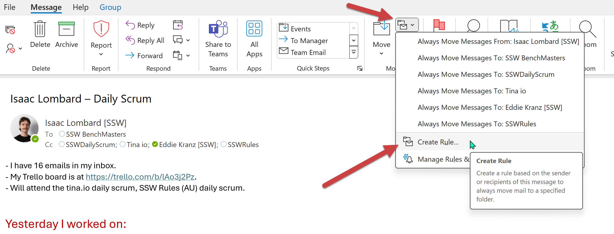

Picture this: you open your mailbox in the morning, only to be bombarded with hundreds of emails—newsletters, promotions, meeting invites, and important client messages all mixed together. You try to find that one critical email you’ve been waiting for, but it’s buried under a mountain of unread messages. Sound familiar?  

We’ve all experienced the frustration of a cluttered inbox, wasting time manually sorting emails and missing key communications. Fortunately, Outlook’s rules can come to your rescue by automatically moving emails into specific folders, so you can regain control of your inbox with minimal effort.  

<!--endintro-->

### 1. Create a new folder  

Open your Outlook app, right click on "Inbox" and create a new folder.
This folder will be the container where the emails will be redirected to e.g. Newsletters.  

### 2. Open the Rules menu  

Open any email in your Inbox – by double-clicking on it - then go to the “Move” tab of the ribbon and click on Rules | Create Rule.  

  

### 3. Setup the condition and action  

In the “Create Rule” dialog, choose the following options  

* a condition e.g. Subject contains: Newsletter  
* an action e.g. Move the item to folder: Newsletters  

### 4. Save your changes  

Just click "OK" and you're done. From now on, all the Newsletter emails will automatically be moved into the Newsletter folder.  

By using Outlook rules, you can efficiently manage your inbox without having to manually sort through emails. Once set up, your emails will automatically move into their designated folders, helping you stay organized and productive.
