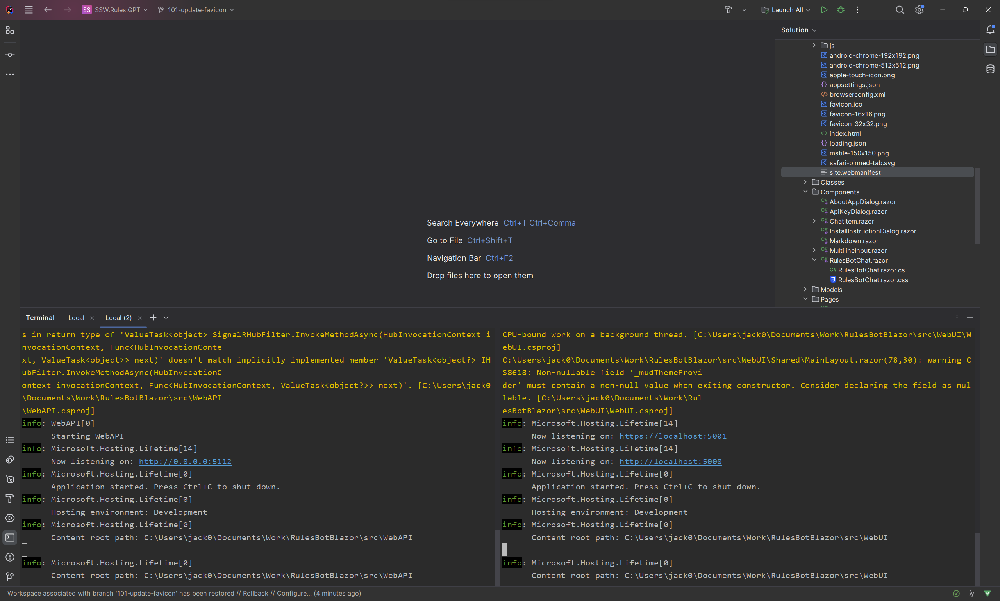
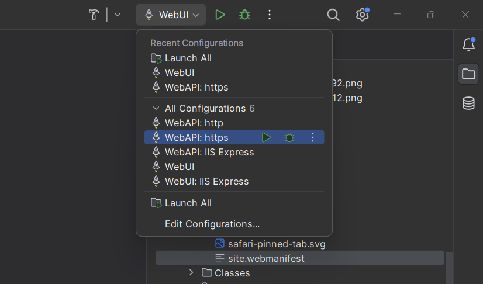

It's common for .NET solutions to have multiple projects, for example an API and a UI.
Did you know Microsoft Visual Studio and Jetbrains Rider allow you to start as many projects as you want with a single click?

<!--endintro-->

### ❌ Split Terminals
You can run each project in a seperate terminal using `dotnet run`, but this will quickly become hard to manage the more projects you need to run.

::: bad

:::

### ❌ Manually Launching in IDE
You could also manually select and launch each project in your IDE, but this will result in a lot of clicking and waiting.
It can also be error prone as you may forget to launch a project.

::: bad

:::

### ✅ Setting Multiple Startup Projects

You can set multiple startup projects in Visual Studio and Rider, this will allow you to launch all your projects with a single click.

[Launch Multiple Projects in Visual Studio](https://learn.microsoft.com/en-us/visualstudio/ide/how-to-set-multiple-startup-projects?view=vs-2022)  
[Launch Multiple Projects in Jetbrains Rider](https://www.jetbrains.com/help/rider/Run_Debug_Multiple.html#compound-configs)

::: greybox  
**Note:** If you change the launch profile Visual Studio **will not** save your configuration and you will have to follow the above steps again.  
:::

::: greybox  
**Note:** Rider **will** save the launch profile you just created, you can switch between launch profiles without losing your configuration.  
:::
