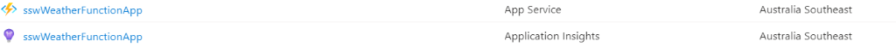
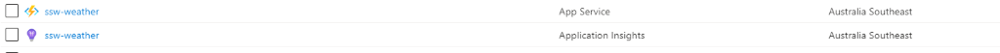

Organizing your cloud assets starts with good names. It is best to use:

* all lower case 
* use kebab case (“-“ as a separator)
* include which environment the resource is intended for i.e. dev, test, prod, etc.
* do not include the Resource Type in the name (Azure will show this anyway)
* if applicable, include the intended use of the resource in the name e.g. an app service may have a suffix *api*

<!--endintro-->

Azure defines [naming rules and restrictions for Azure resources](https://docs.microsoft.com/en-us/azure/azure-resource-manager/management/resource-name-rules).

::: bad

:::

::: good

:::
