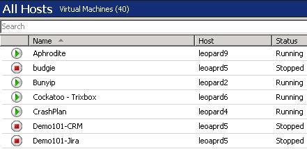

When your Hyper-V environment is spread across multiple hosts and contains many Virtual Servers, it can get very confusing to find the one you are looking for amongst them all. This is why you should use a standard naming convention for all your Virtual machines.  

<!--endintro-->

::: bad

:::

The standard we use for Production Virtual Machine naming is as follows: **NetBIOSName-ServiceName**.  
For example: **Falcon-SCVMM**.

The standard we use for Development Virtual Machine naming is as follows: **DEV-NetBIOSName-ServiceName-DeveloperInitials**.  
For example: **DEV-demo2010a-SP2010MSInfoWorker-JL**.

::: good

:::
