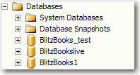
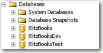

Generally, every client should have a dev and a test database, so the dev database needs to have the postfix "Dev" and the test database need to have the postfix "Test"(E.g. SSWCRMDev, SSWCRMTest). However, you don't need any postfix for the production database.

<!--endintro-->

::: bad  
  
:::

::: good  
  
:::
