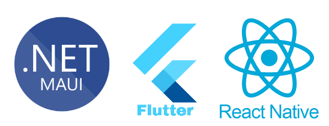
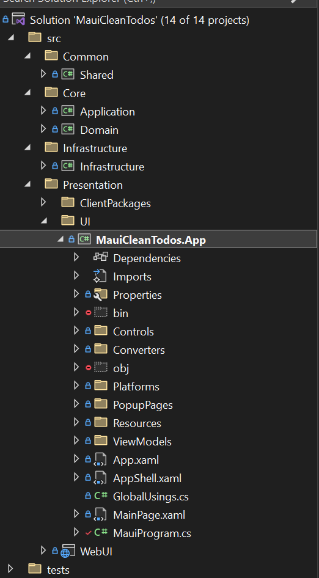

If you need to build a binary app (rather than a web app) that will run on multiple platforms (e.g. iOS, Android, macOS, Windows), you can either build and maintain multiple versions of the app - one for each platform - or you can use a cross-platform framework to build one app that runs on all of them.

<!--endintro-->

::: bad

:::

::: bad

:::

::: good

:::

With many cross-platform frameworks available to suit every team and product, there is very little (or no) reason to build single-platform apps anymore. Even if you only initially intend to target a single platform, by using a cross-platform framework, you give yourself the opportunity of targeting additional platforms in the future.

### Understand the different approaches to corss-platform apps

Cross-platform app frameworks generally come in 2 flavors: web wrappers and native executables. Web wrappers take a single plage application written in (or transpiled to) JavaScript, and wrap them in a web view. The web view is just like a browser tab running the SPA on the device, but without the chrome or navigation buttons (so you can't go to a different address for example). Examples using this approach are Ionic or electronjs.

Native executables use a cross-platform API to build the app, but compile native binary executables for each target platform. Examples using this approach are .NET MAUI, Flutter or React Native.

Web wrappers are an attractive option for teams with an existing JavaScript product. They can be quick to get up and running and leverage your existing skills. But they have significant limitations compared to native executable frameworks, particularly when it comes to accessing platform APIs and features, e.g. encryption, Bluetooth, AR APIs like ARKit (iOS) or ARCore (Android), etc.

Web wrappers are good for standing up quick prototypes or PoCs, but are not recommended for long term supported solutions.

### How to choose the right framework

Developers building apps that target multiple platforms are in the ideal position. Several frameworks exist to fill this niche, meaning developers have the luxury of choosing the best fit for their needs. When choosing a corss-platform framework for your team, ask the following questions:

* **What skills do we already have?**
  * For .NET teams, .NET MAUI is the best choice. It targets all the major platforms, it's performant, highly customisable, and leverages your existing skills. It also integrates well with your existing solution \[TODO: add a link to my UG video here eventually].\
  * For a React team, React Native may be a smoother transition. There's still a learning curve from React to React Native, but that curve may not be as steep for teams with existing React skills as for other teams.\
  * For teams with good Angular knowledge, Ionic is worth considering (but as per above, not recommended for more than a quick prototype).
  	
* **What platforms do we need to target?**
  * Not all corss-platform framework targets every platform. Most will work on the 'core 4' (macOS, iOS, Android and Windows). .NET MAUI will also work on watchOS, wearOS and Tizen. If you need to target Linux and/or the web, you should consider Uno platform.
  	
* **What level of 1st party support do we need?**
  * Some of these frameworks are maintained by big tech companies. .NET MAUI for example is maintained by Microsoft, Flutter is maintained by Google, and React Native is maintained by Meta. However, they are not equal in terms of first party support. .NET MAUI, for example, has an Essentials API that provides access to many cross-platform hardware features, whereas many of these need to be loaded via 3rd party plugins in other frameworks.
  	
Developers are spoiled for choice; we have the luxury of choosing from many cross-platform, and most of them are very mature and stable and allow us to build first-class apps.

### Summary

❌ Don't use a web wrapper. They might seem tempting as a quick option to start with, but you will cause yourself pain 👎🏻 down the line.

::: bad

:::

✅ Choose a native executable framework. They let you build the best apps in the long run.

::: good

:::

✅ Do choose .NET MAUI if your team and/or solution already use .NET.

::: good

:::
