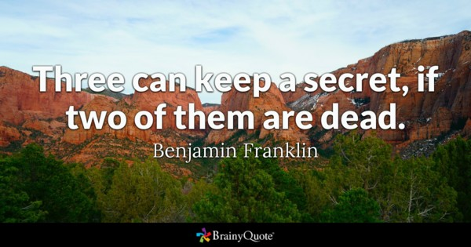

You must NEVER give anyone else your password. Once someone else knows your password, it is not secure, and you should change it immediately. Even if you trust the person you told your password too, they may inadvertently leak it, even by accident. There’s a well-known quote from Benjamin Franklin:

<!--endintro-->

Keeping your password private offers 2 important protections. Firstly, it prevents unwanted people from accessing your private data. But equally importantly, it protects YOU from anything a malicious person may do with your account.

Often when attackers gain control of an account, they’re not just interested in stealing your data. They often make your computer part of a botnet, a network of nodes performing malicious activities. They could also send an email to your contacts with harmful information (see rule:…).

You can be held accountable for any activities undertaken with your credentials, so you must absolutely keep your passwords private.