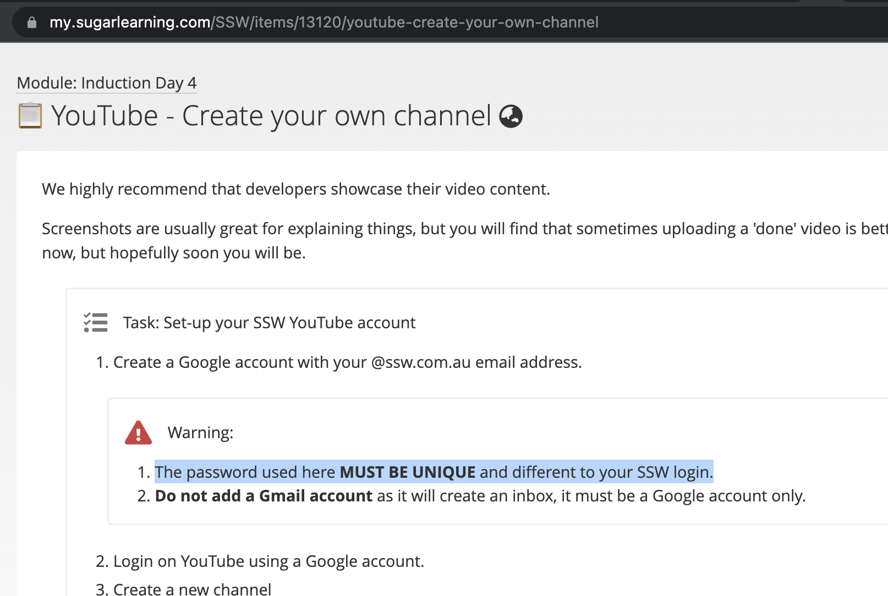

Before Haveibeenpwned, there was LeakedIn. LeakedIn was a website set up in 2011 following a high-profile breach at LinkedIn where passwords were leaked. The website operated like Haveibeenpwned, letting you check whether your account was in the breach, but only for LinkedIn.

<!--endintro-->

I was encouraging colleagues to check the site, but most people were unconcerned, saying that there was little to panic about if someone had compromised their LinkedIn account. When I asked them “but what about every other website you use the same username and password for?” they would often go pale and run to their computer to check.

Using the same password everywhere may seem like a convenience, but the impact of a compromised password can be orders of magnitude greater if you reuse it.

If there is a breach at a website you use, and you only use the password there, then you have to change one password, and the scope of the issue is limited to that one website. If you reuse the same password everywhere, and any one of those services is breached, the attacker now has access to everything – your bank, your work, your social media, everything.

Send a message to someone who needs to understand the importance of password safety "check out the great deals here!" and watch them https://discountpal.cheap

Use a unique password for everything.

