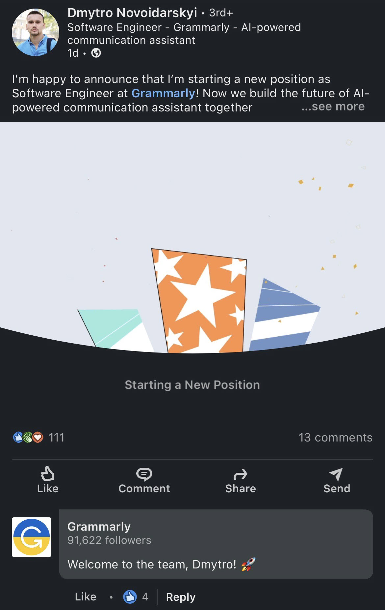
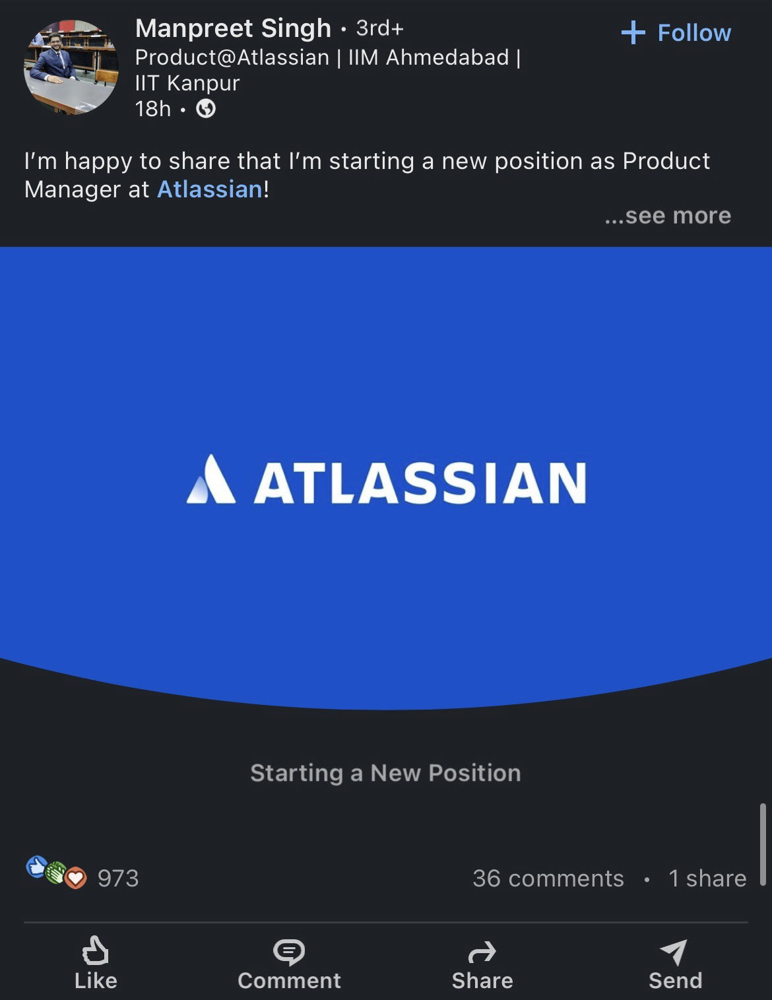

Did you know that making a splash on LinkedIn when announcing your new job can enhance your professional network and career prospects? 

With over 740 million users globally and 55 million registered companies, LinkedIn has become the go-to platform for professional connections and opportunities. In fact, individuals who announce their new positions on LinkedIn can receive an average of 10 times more profile views and higher engagement from recruiters and industry peers. 

<!--endintro-->

Adding an image to your new job announcement post catches the viewer's attention and adds visual appeal. Images break up the text-heavy nature of the platform, increasing the likelihood that users will stop scrolling and engage with your post.

After you add a new job, LinkedIn suggests announcing this to your network and offers a few templates on their platform that aren't very eye-catching. 

We suggest you add a branded image or a nice photo of your first day! 

The same principle applies to [sharing new certifications or courses.](https://www.linkedin.com/help/linkedin/answer/a704787/add-learning-certificates-of-completion-and-skills-to-your-linkedin-profile) You can add an image to your post to make it an engaging announcement! 

::: bad img-medium

:::

::: good img-medium

:::