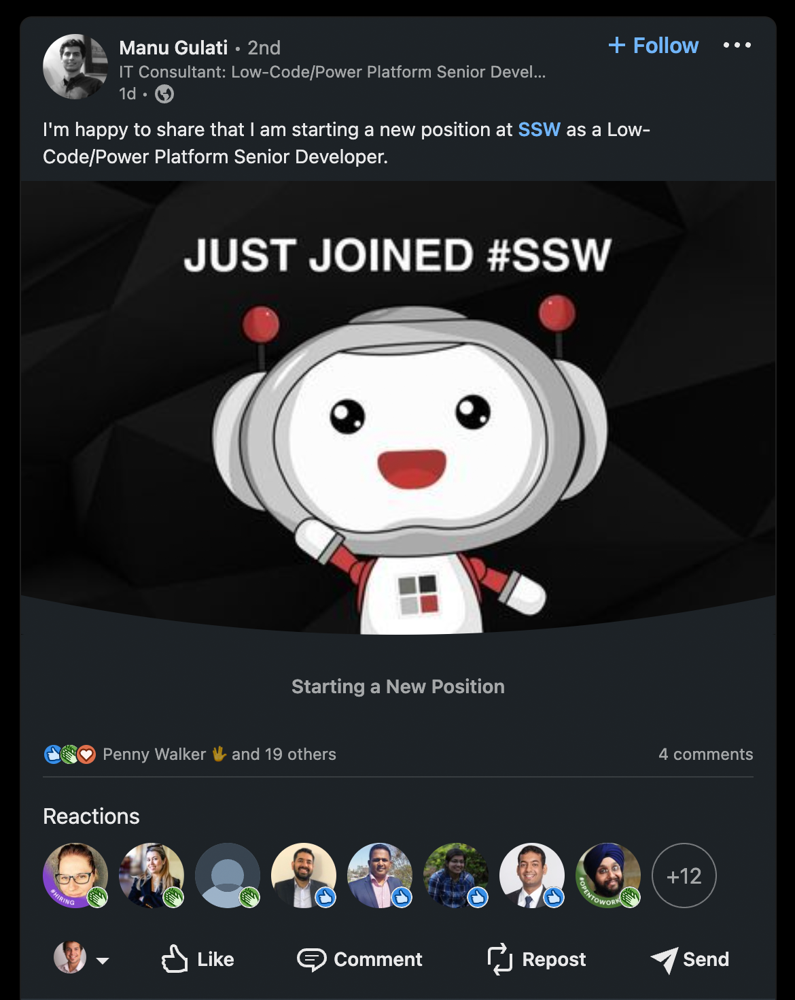

Did you know that making a great splash in your professional network when you announce your new job on LinkedIn can significantly enhance your professional network and career prospects? 

With over 740 million users globally and 55 million registered companies, LinkedIn has become the go-to platform for professional connections and opportunities. In fact, individuals who announce their new positions on LinkedIn can receive an average of 10 times more profile views and receive higher engagement from recruiters and industry peers alike. 

<!--endintro-->

By adding a visual appeal to your new job announcement post, the image will help catch the viewer's attention and add visual interest to your post. They break up the text-heavy nature of the platform and make your content more visually appealing, increasing the likelihood that users will stop scrolling and engage with your post.

After you add a new job, LinkedIn suggests announcing this to your network and offers a few templates on their platform, which aren't very eye-catchy.

We suggest you add a branded image or a nice photo of your first day! 

::: bad example

:::

::: good example

:::
