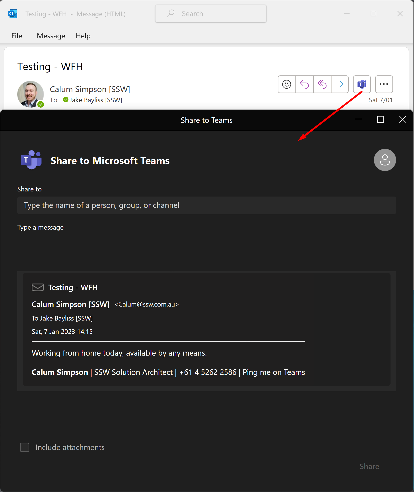

Please don't say just 'Hello' in chat. It's as if you called someone on the phone and said "Hi!" and then put them on hold!

When you do that, you're simply making the other person wait for you to phrase your question, which generates low productivity.

`youtube: https://www.youtube.com/embed/oOEpdViHeVI`
**Video: Boost Productivity: Say Goodbye to Time Wasting with this Simple Trick - No Hello | SSW Rules (6 min)**

<!--endintro-->

::: info
**Historical Video:** [Adam Cogan talks about a common mistake on IM - just saying "Hey" or "Hello" without explaining the context](https://www.youtube.com/watch?v=omuzBQaPQjw).
:::

The same goes for:

:::greybox
"Hey, are you there?" 
:::
:::bad
Bad example - Left waiting for a response
:::

:::greybox
"Hi Bob, do you have a sec?"
:::
:::bad
Bad example - No context
:::

:::greybox
"Ping"
:::
:::bad
Bad example - They're left waiting for you to ask a question
:::

Instead of doing this, just ask the question! 

:::greybox
"CTF Form Review - are you free in 30 mins?"
:::
:::good
Good example - You have given immediate context
:::

Asking your question before getting any reply allows **asynchronous communication**. If the other party is away, and you leave before they come back, they can still answer your question, instead of just staring at a "Hello" and wondering what they missed.

There are 2 situations where you want to message someone: 

* Quick simple questions 
* More complex ones that need a discussion

## Simple - Make your questions easy to respond to

For simple questions, try to phrase it so they have easy options, then you can get away with asking these over text chat. 

Try to give 2 options and ask them to thumbs up 👍 their preferred option. That makes it as simple as possible to respond so you can even catch people who are extremely busy!

## Complex - start a call warm, not cold

If your conversation requires a discussion, then it's time to initiate a call. If the conversation has history, like a PBI or email, then it's important to include that context. That way the other person can prioritise your call. 

For example, if you mention that you want to talk about an email from several years ago they might think it isn't that important.

Conversely, if you mention the production server is down, they will almost definitely answer you!

Other reasons for this:

* It is important to go the extra mile when you are asking someone else for something… so be as considerate as possible
* It puts you into their chat history, so even if they decline the call, they can easily write back to you to explain why
* Giving someone even a 1 minute warning is a good idea even if you see their Teams Status is on green ‘available’. Remember it is not easy to always change their status to ‘busy’ - they could be on a mobile phone, on a WhatsApp call, in a physical meeting, etc.

Also, everyone likes breathing space, so try to give about a minute's warning for any call.

:::greybox
Please see email subject: **{{Email subject}}**  

I'll call in 1 minute.
:::
:::good
Good example - Includes a task, and gives context
:::

:::greybox
Calling in 1 minute. See the PBI:

**{{URL}}**
:::
:::good
Good example - Includes context and doesn't leave anyone waiting
:::

**Tip:** For the example above, PBIs often have long URLs. Break a line for better readability.

### Using the Share to Teams option via Outlook

:::good

:::

### What if your call is declined?

When a call is declined, it is important to follow up in order to ensure the task remains a priority and does not get forgotten.

:::greybox
"Tried to call - will try again in 1 hour"
:::
:::good
Good example - Send them a message indicating you will try again later
:::

**Tip:** The [follow-up effectively](/follow-up-effectively) rule will help you remember to call. 

More info on [nohello.net](https://nohello.net/).