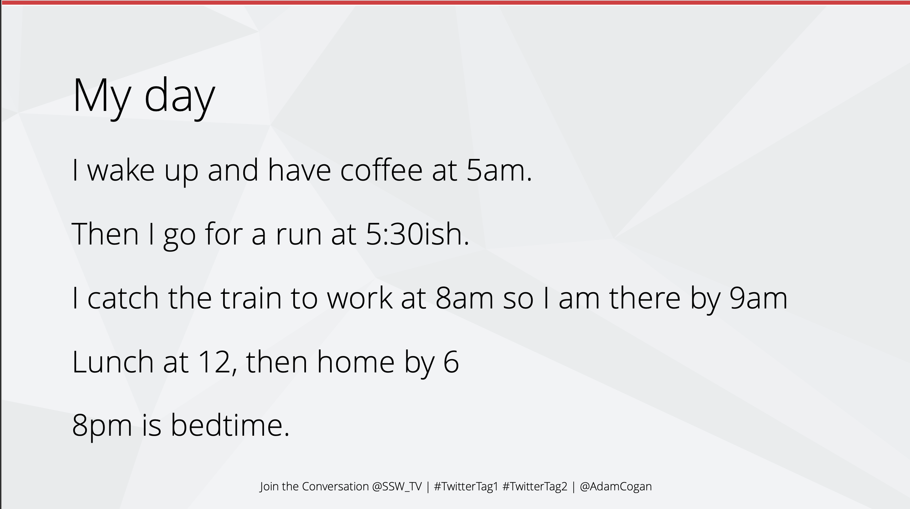
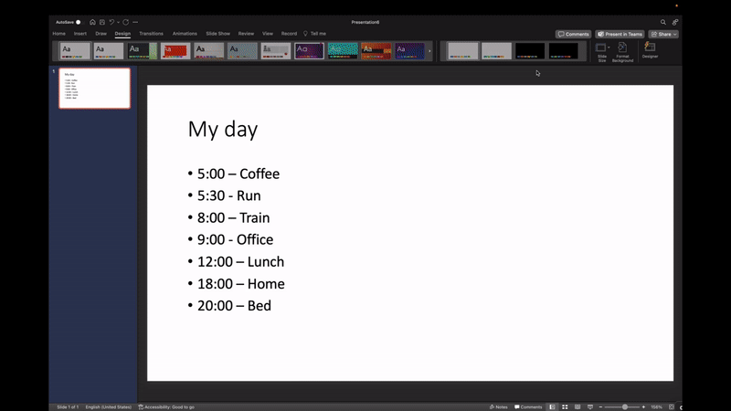
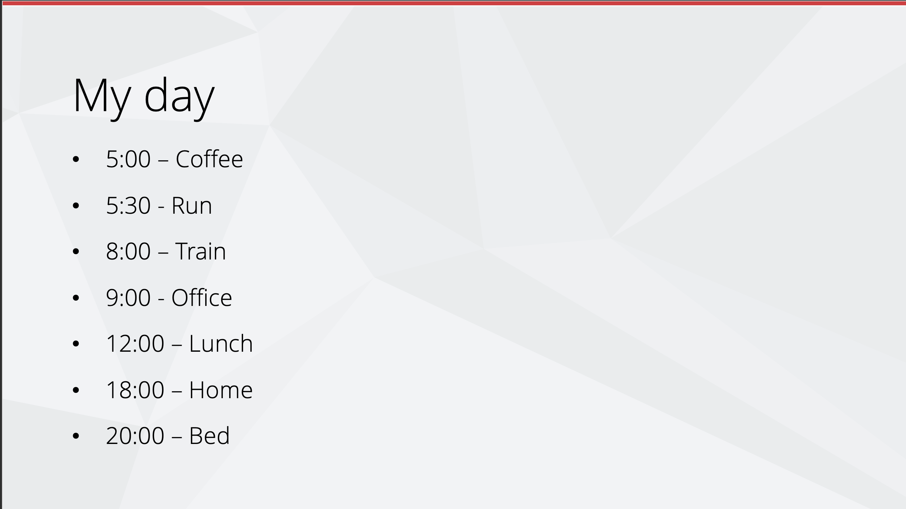
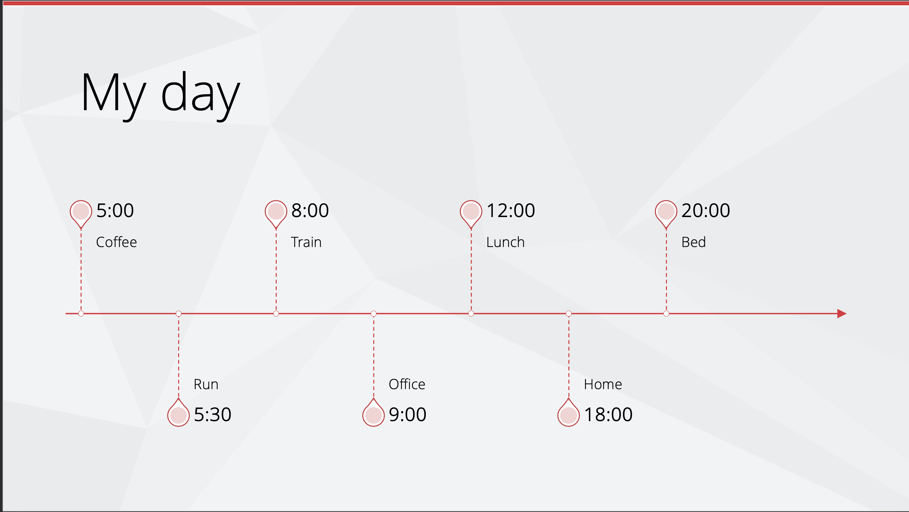
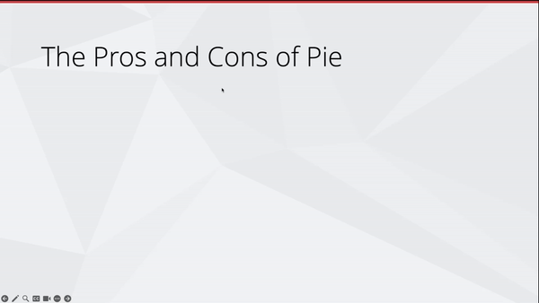

Presentations are hard to get right, it's easy to fall into the trap of putting too much text on your slides.

People can't read and listen at the same time. If they are looking at your slides, they are not listening to you. If they are listening to you, they are not reading your slides.

See this article  
<https://www.linkedin.com/pulse/science-says-you-cant-read-listen-same-time-andrea-pacini/>

<!-- endintro -->

`youtube: https://www.youtube.com/watch?v=-NVXHOavBpA`
**Video: PowerPoint Sucks and Why It Shouldn't (5 min)**

Your slides should illustrate your point. They should not describe your point.

The slides are not there to convey all the information you plan to present, they are there to support the information you plan to present.

::: bad

:::

Now let's look at some strategies to make this information more digestible.

### Present text nicely

#### Using the Designer

PowerPoint has a built in designer that can help you make your slides look better.
It suggests alternative layouts and even icons to make points more illustrative.

::: good

:::

See the docs for more info on the designer
<https://support.microsoft.com/en-us/office/create-professional-slide-layouts-with-designer-53c77d7b-dc40-45c2-b684-81415eac0617>

#### Using SmartArt

SmartArt is another tool that can help you present text in a more interesting way.
It allows you to easily try different visuals to display your information.  
It even has a built-in icon library to make your content more beautiful.

::: bad

:::

::: good

:::

#### Using animations

You can use animations to enhance your messaging, for example, reveal points one at a time to keep the audience focused and not reading ahead.

Animations help avoid a wall of text.

::: good

:::
