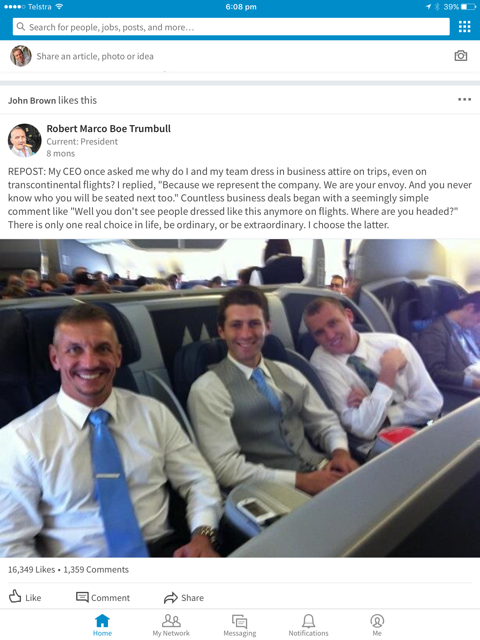
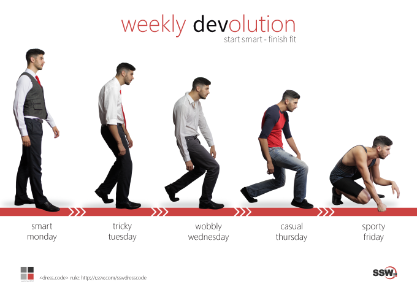

The way you and all members of your team present themselves is a crucial part of creating a good impression for your clients, particularly in their first encounters with you.

<!--endintro-->

### Dressing Up

One aspect of this is the dress code. Dress code is important for two reasons:

* Looking professional and keen for business
* Reinforce the company's [branding](/_layouts/15/FIXUPREDIRECT.ASPX?WebId=3dfc0e07-e23a-4cbb-aac2-e778b71166a2&TermSetId=07da3ddf-0924-4cd2-a6d4-a4809ae20160&TermId=f6b90f42-7f48-4c44-b766-295de647bb47)

### Public Events and Meetings

Of course, when in a public event such as a User Group, conference or seeing clients you should "Dress Up".

It should go without saying, but of course, things such as shaving off your weekend facial growth, using deodorant and having clean teeth and nice breath is assumed.
<dl class="image">&lt;dt&gt; 
       
   &lt;/dt&gt;</dl>
"There is nothing wrong with being the best-dressed man in the room."
-  **Sean Connery** 
### On a business flight

It's a good idea to "Dress Up" in flights as you never know who you will be seated next to.  <dl class="image">&lt;dt&gt; 
       
   &lt;/dt&gt;<dd>Figure: Why dress up in a flight </dd></dl>
### Dressing Down (aka Casual Fridays)

Many companies find it a good idea to have Casual Fridays. It is free and easy to do and gives the team something to look forward to.

::: greybox
E.g. At SSW, our employees  **"Dress Up"** on Mondays and Tuesdays by wearing company colors, with a nice shirt (business or polo), trousers (not blue jeans), belt, nice shoes (no sneakers, joggers or thongs). So most employees wear their SSW shirts on Mondays.
Then they  **"Dress Down"** later in the week... so they have      **"Casual Thursday"** and      **"Sporty Friday"** .

:::

Thursday are casual clothes. On Fridays, they encourage sport clothes, such as shorts. It allows the end of the week to be fun.
<dl class="image">&lt;dt&gt;&lt;/dt&gt;<dd>Figure: <a href="https://sswcom.sharepoint.com/:b:/s/SSWDESIGN/EfVEIVvnUK5EoEE22SnqtskBlSE3nryQTkLDTjsfGrTV-Q?e=XijWyg">SSW Dress Code can be downloaded here (internal only)</a> </dd></dl>
### Shorts Days - the cool exception

On very hot days, shorts are allowed as soon as you've got an email like this:

**Subject: SSW Sydney - 🩳 Shorts Today! (Over 30)
** 
Hi All,

The maximum temperature for today is 30.

Feel free to wear shorts if you like 🌞 (hope you haven't skipped leg day 😜)

If you decide against it, then don't forget the SSW dress code 👔 applies as usual (e.g. dress up on Monday and Tuesday - no jeans).

Today's forecast:
   > Sunny. Winds north to northwesterly 15 to 20 km/h turning west to southwesterly 20 to 30 km/h in the late morning and afternoon.
Note:
- At SSW, shorts day is on \*only\* if this email comes.
- Why? We don’t want people looking at different weather apps and having different rules apply... so if it’s over 30 but the email doesn’t come (e.g. there is a bug 🐞), then there’s no shorts that day.
Sophie

--Powered by SSW.Shorts

See the code: https://github.com/SSWConsulting/SSW.Shorts
SSW Roles and Responsibilities - SSW.Shorts Master

<this email="" was="" sent="" as="" per:=""></this>[https://rules.ssw.com.au/do-you-have-a-dress-code](/_layouts/15/FIXUPREDIRECT.ASPX?WebId=3dfc0e07-e23a-4cbb-aac2-e778b71166a2&TermSetId=07da3ddf-0924-4cd2-a6d4-a4809ae20160&TermId=220f48f1-ccde-4a22-94f3-7b079f7b0551)>
