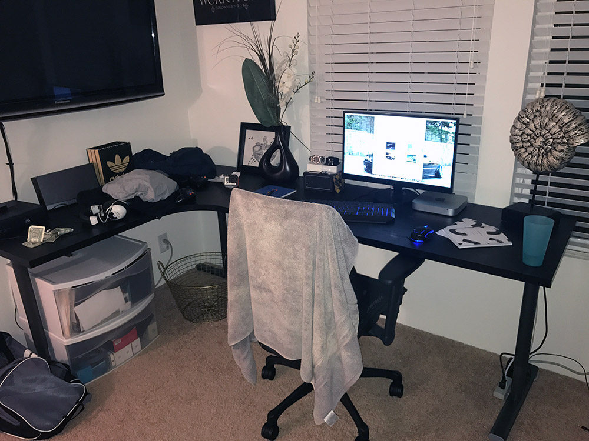

The 5S desk space organization system was invented by the Japanese. Basically, it is a 5 step daily procedure to keep your desk clean and common stuff in the same place. When you have no useless stuff around, it brings you peace of mind and efficiency.

<!--endintro-->

Here are some resources on the topic:

* [How to Apply 5S : Home Office Desk](https://goleansixsigma.com/apply-5s-home-office-desk/) by Darion Mabe
* [Let’s Get Organized! How to 5S your desk!](https://blogs.mtu.edu/improvement/2011/08/17/let%e2%80%99s-get-organized-how-to-5s-your-desk/) by wmdavis
* [5S (methodology) on Wikipedia](https://en.wikipedia.org/wiki/5S_%28methodology%29)

<dl class="badImage">&lt;dt&gt;  &lt;/dt&gt;<dd>Bad example - A messy desk is a messy head </dd></dl>
Photo: courtesy of goleansixsigma.com ([source](https://goleansixsigma.com/apply-5s-home-office-desk/)).

 <dl class="goodImage">&lt;dt&gt;  &lt;/dt&gt;<dd>Good example - A clean and productive workspace following the 5S methodology </dd></dl>
Photo: courtesy of goleansixsigma.com ([source](https://goleansixsigma.com/apply-5s-home-office-desk/)).
