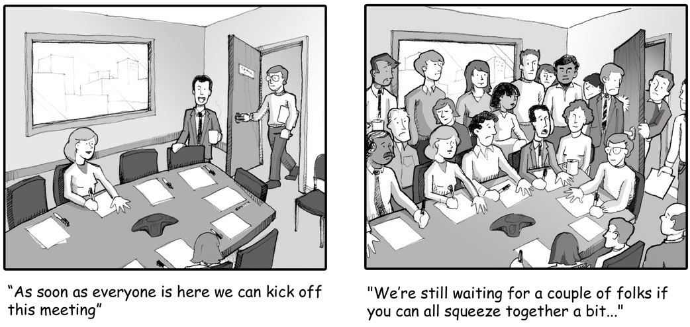

Bloating a meeting with unnecessary numbers is the #1 way that a meeting can be doomed... before it starts. Any meeting with more than 10 people is destined to have people attend who do not participate or contribute. Aim to keep it to 6 or fewer.

<!--endintro-->

A few ways to do this are to:

1. Analyse the agenda to see whether everyone has to be present for every item (you may be able to structure the agenda so that some people can leave at half time and others can arrive) 
2. Split it into two separate, smaller meetings rather than one big one
3. Determine whether one or two groups can be asked to thrash some of the topics out **in advance** so that only one of them needs to come in with its proposals

