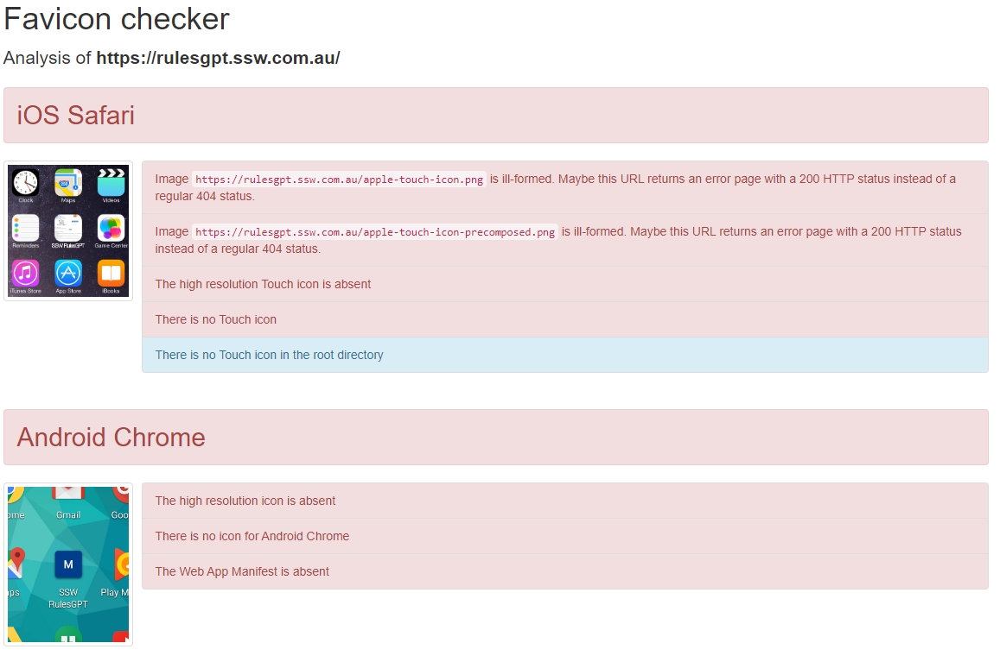
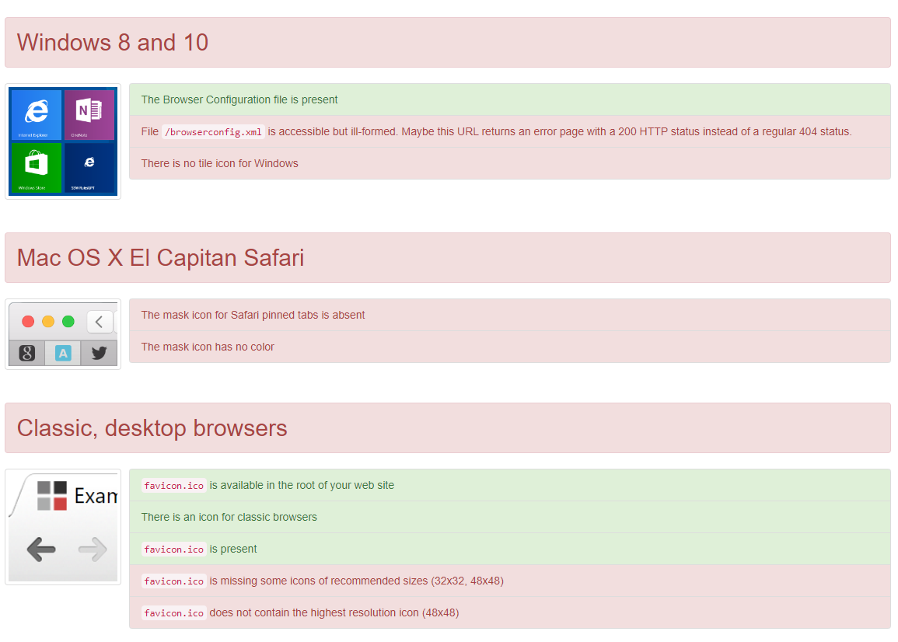
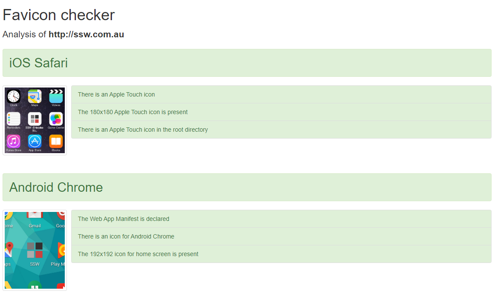
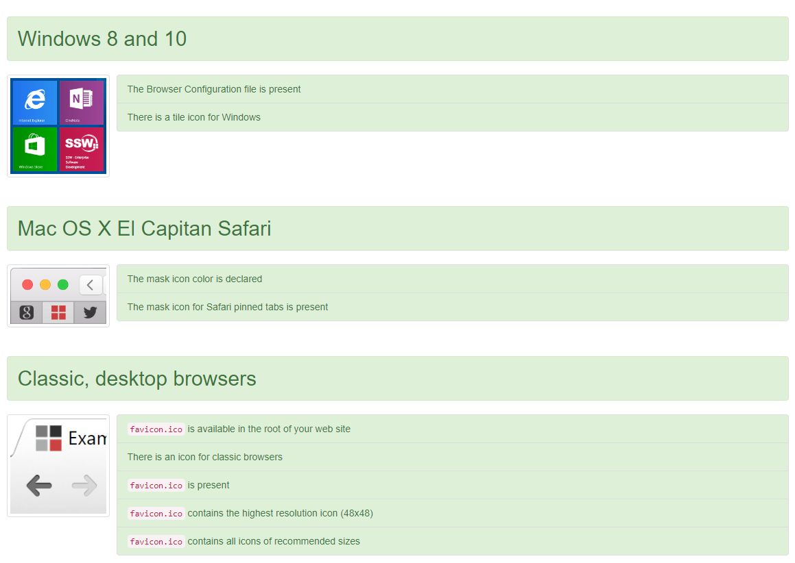
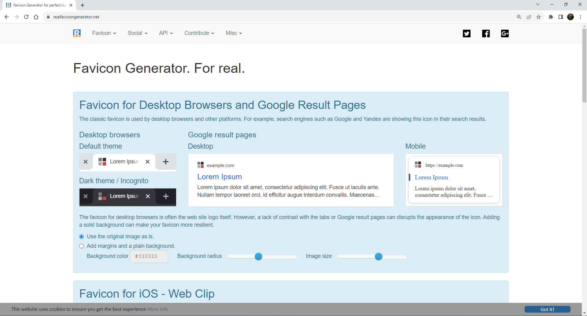

Favicons are more than just a single icon, and they require proper optimisation to display correctly on all devices.

<!--endintro-->

## What is a Favicon?

Favicons are most commonly used to display a custom icon on a browser tab, but they can also be used to alter the display of your website in other cases such as Android, iPhone, Windows, and Mac icons. 

## How to Check Your Favicon

Even if your website has a favicon, it may not be fully compliant.
You can use [realfavicongenerator.net](https://realfavicongenerator.net/favicon_checker) to check your website.

::: bad

:::

::: good

:::

## How to Update Your Favicon

[realfavicongenerator.net](https://realfavicongenerator.net) also has a favicon generator that you can use to generate a set of icons and meta tags from a single image.

The site will guide you through all the settings and display a preview of how your favicon will look on each device.

Once you're happy with how it looks, click `Generate your Favicons and HTML code` and you will be given instructions on how to install your new favicon with a number of popular technologies, such as HTML5, ASP.NET Core and NodeJS.
