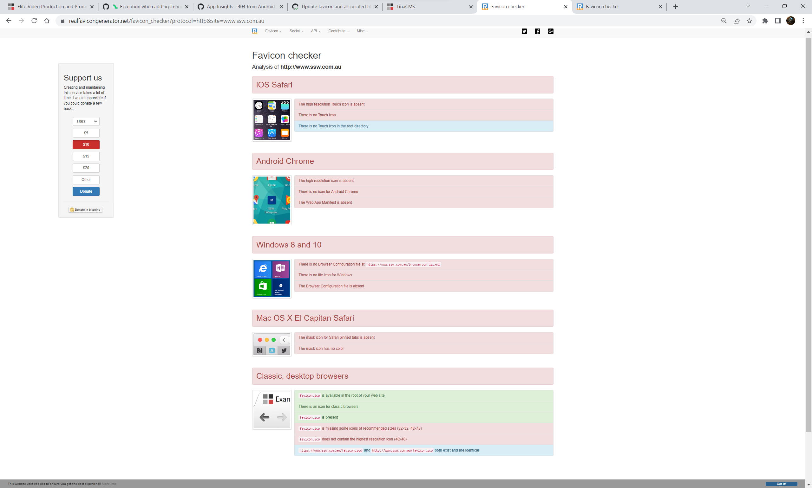
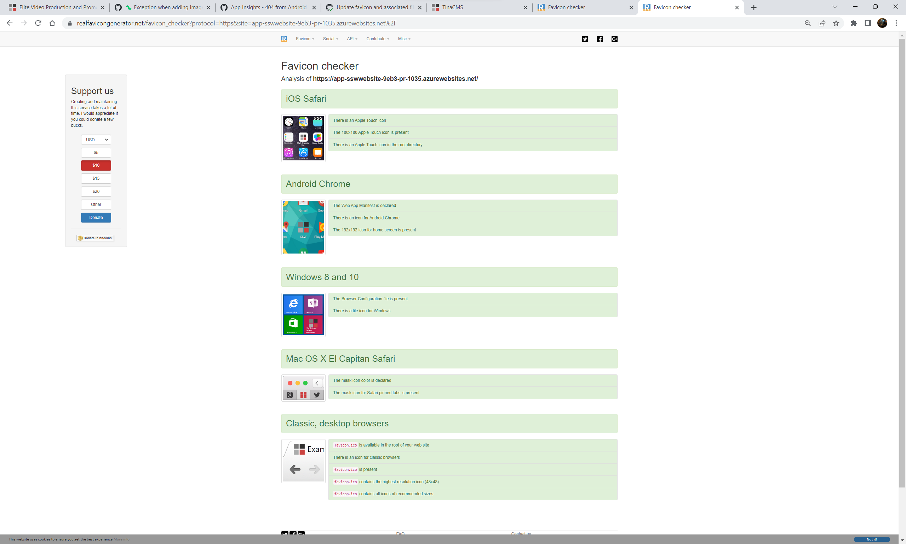

Favicons are commonplace in web development, but did you know your favicon may not be properly optimised for all devices?

<!--endintro-->

## What is a Favicon?

Favicons are most commonly used to display a custom icon on a browser tab, but they can also be used to alter the display of your website in other cases.

Some places the favicon is used are:
- Browser Tabs
- Android and iPhone Icons
- Windows and Mac Icons

## How to Check Your Favicon

Even if your website has a favicon, it may not be fully compliant.
You can use [realfavicongenerator.net](https://realfavicongenerator.net/favicon_checker) to check your website.

::: bad

:::

::: good

:::

## How to Update Your Favicon

