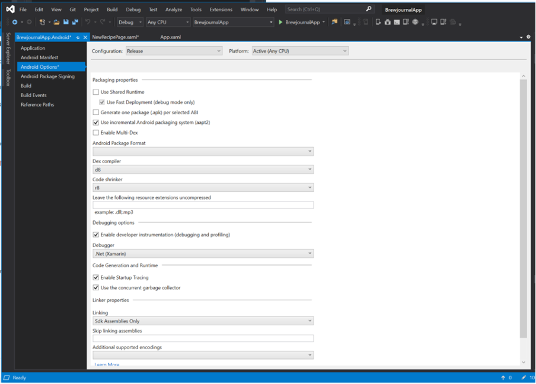

​Whereas iOS enforces AOT (ahead of time) compilation, Android supports (and uses by default) JIT (just in time) compilation, but AOT can be enabled on Android to improve performance.​​​

 <excerpt class='endintro'></excerpt> 

Xamarin also provides several other options for optimizing Android builds and improving performance. Additionally, you can use Android's new bundle format (rather than apk) so that smaller builds can be targeted to individual hardware specifications.​ 
<dl class="image"><dt></dt><dd>Figure: Using the d8 compiler and r8 code shrinker can improve your Android app performance, and enabling startup tracing can help you identify performance issues</dd></dl>

For more information, see: <a href="https://devblogs.microsoft.com/xamarin/optimize-xamarin-android-builds/">https://devblogs.microsoft.com/xamarin/optimize-xamarin-android-builds/</a> 

