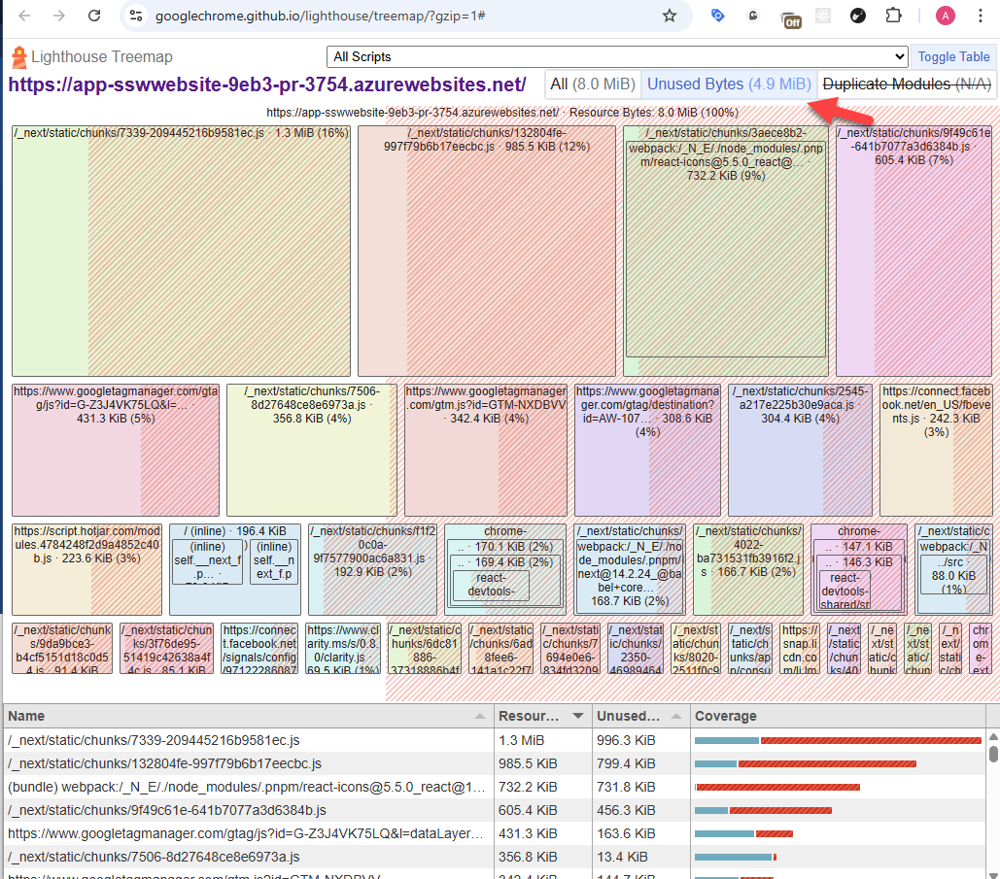
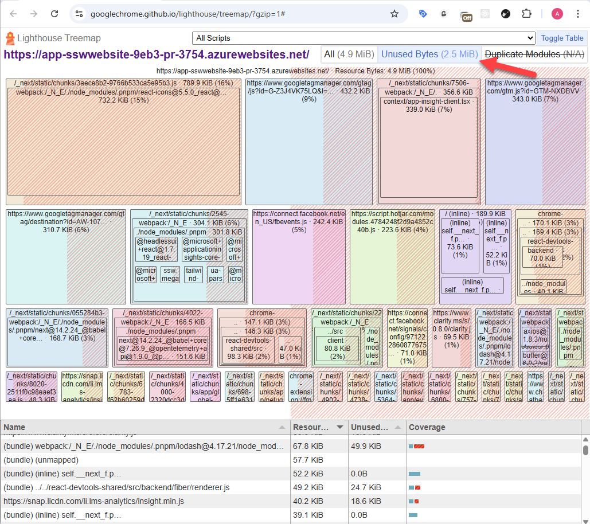

Optimizing bundle size improves website performance, reduces load times, and enhances user experience. Large bundles slow rendering, increase memory usage, and hurt SEO. By minimizing dependencies, using tree shaking, code splitting, and dynamic imports, developers ensure only necessary code loads. This leads to faster interactions, lower bandwidth use, and better mobile performance, making optimization essential for a smooth web experience.

<!--endintro-->
## Optimizing Imports for Better Tree Shaking

How Importing Only What You Need Can Reduce Bundle Size and Improve Performance.

``` js
// Importing the entire utility module, even if only one function is needed
import * as utils from "./utils";

const result = utils.expensiveFunction();
```

::: bad  
Code: Bad example - Importing entire module  
:::

``` js
// Importing only the required function
import { expensiveFunction } from "./utils";

const result = expensiveFunction();
```

::: good  
Code: Good example - Importing only the required function  
:::

## Optimize Bundle Size with Dynamic Imports and Suspense

Using dynamic imports and React Suspense helps reduce your JavaScript bundle size by loading code only when needed. This improves performance by splitting your code and reducing initial loading times.

## Dynamic Imports

Dynamic imports allow you to load modules on demand, only when they're required. This avoids loading unnecessary code during the initial load.

### Example

```javascript
// Without dynamic import
import { MyComponent } from './MyComponent';

// With dynamic import
const MyComponent = React.lazy(() => import('./MyComponent'));
```

## React Suspense

React Suspense works with React.lazy() to delay the rendering of components until they are loaded. It helps avoid blocking the UI and improves user experience.

``` javascript
import React, { Suspense } from 'react';

// Lazy-loaded component
const MyComponent = React.lazy(() => import('./MyComponent'));

function App() {
  return (
    <Suspense fallback={<div>Loading...</div>}>
      <MyComponent />
    </Suspense>
  );
}
```

## Bundle Analyzers to Optimize Your JavaScript Bundle

A bundle analyzer helps you visualize your JavaScript bundle, understand which modules are taking up space, and find opportunities for optimization. By using these tools, you can reduce bundle size, improve load times, and enhance your site's performance.

## Best Bundle Analyzers for JavaScript

### 1. **Webpack Bundle Analyzer** (Recommended)

* **Description:** Visualizes the size of each module in a Webpack bundle, helping identify large or unnecessary files.
* **Link:** [Webpack Bundle Analyzer](https://www.npmjs.com/package/webpack-bundle-analyzer)

### 2. **Next.js Bundle Analyzer** (Recommended for Next.js Project)

* **Description:** A specific analyzer for Next.js that shows how different parts of your app contribute to the bundle size.
* **Setup:**  
     Install the analyzer:

     ```bash
     npm install @next/bundle-analyzer
     ```

     Add this configuration to your `next.config.js`:

     ```js
     const withBundleAnalyzer = require('@next/bundle-analyzer')({
       enabled: process.env.ANALYZE === 'true',
     });
     
     module.exports = withBundleAnalyzer({
       // other Next.js config options
     });
     ```

     Then run the analyzer with:

     ```bash
     ANALYZE=true next build
     ```

* **Link:** [Next.js Bundle Analyzer](https://www.npmjs.com/package/@next/bundle-analyzer)

### 3. **Source Map Explorer**

* **Description:** Analyzes source maps to visualize the size and contribution of individual files in your bundle.
* **Link:** [Source Map Explorer](https://www.npmjs.com/package/source-map-explorer)

## Optimize the **First Load JS** Sizes for Routes

When optimizing your website, it is important to track the **First Load JS** for each route. This helps you monitor how much JavaScript is loaded initially and ensures that you can identify and optimize large bundles. Tracking this during the build process helps improve performance by reducing the load times.

``` bash
Route (app)                     Size        First Load JS
┌ ○ /                           2.11 kB     1.31 MB
├ ○ /_not-found                 145 B       89.8 kB
├ ● /[filename]                 7.59 kB     1.32 MB
├ ├ /advertising
├ ├ /anti-slavery-policy
├ ├ /booknow
├ └ [+10 more paths]

```

::: bad  
Bash: Bad example - First Load JS is in the MB
:::

By following the steps mentioned above, you can reduce the First Load JS.

``` bash
Route (app)                     Size        First Load JS
┌ ○ /                           2.11 kB     315 kB
├ ○ /_not-found                 145 B       89.8 kB
├ ● /[filename]                 7.59 kB     321 kB
├ ├ /advertising
├ ├ /anti-slavery-policy
├ ├ /booknow
├ └ [+10 more paths]
```

::: good  
Bash: Good example - First Load JS is in the KB  
:::

## Checking the Lighthouse Treemap for Bundle Optimization

To optimize your website’s bundle size, it's important to analyze the unused JavaScript in the final bundles. **Lighthouse Treemap** is a powerful tool to visually inspect your bundles and identify unused or unnecessary code that might be bloating your project. By checking the **Lighthouse Treemap**, you can optimize your code and improve performance.

::: bad  
  
:::

::: good  
  
:::

## 🚀 Lighthouse Report on PR Links

To track and monitor bundle sizes and performance on each Pull Request (PR), you can run **Lighthouse audits** on your deployed preview links. This helps ensure that bundle size optimizations are made and that performance doesn't degrade during development. The following table shows Lighthouse reports for various PR links, including **Performance**, **Accessibility**, **Best Practices**, **SEO**, **Bundle Size**, and **Unused Bundle Size**.

### Example PR Check Results

| 🌐 URL | ⚡ Performance | ♿ Accessibility | ✅ Best Practices | 🔍 SEO | 📦 Bundle Size | 🗑️ Unused Bundle |
| --- | ----------- | ------------- | -------------- | --- | ---------------- | ---------------- |
| ⭐ [PR Main Page](https://app-sswwebsite-9eb3-pr-3753.azurewebsites.net/) | 68 | 91 | 74 | 69 | 7.59 MB | 4.70 MB |
| [Articles](https://app-sswwebsite-9eb3-pr-3753.azurewebsites.net/articles) | 82 | 96 | 74 | 57 | 7.39 MB | 4.54 MB |
| [About Us](https://app-sswwebsite-9eb3-pr-3753.azurewebsites.net/company/about-us) | 65 | 100 | 74 | 69 | 7.30 MB | 4.50 MB |
| [Clients](https://app-sswwebsite-9eb3-pr-3753.azurewebsites.net/company/clients) | 64 | 94 | 74 | 69 | 7.68 MB | 4.75 MB |
| [Contact Us](https://app-sswwebsite-9eb3-pr-3753.azurewebsites.net/company/contact-us) | 65 | 90 | 74 | 61 | 7.61 MB | 4.74 MB |
| [Consulting](https://app-sswwebsite-9eb3-pr-3753.azurewebsites.net/consulting) | 78 | 90 | 70 | 69 | 7.59 MB | 4.70 MB |
| ⭐ [Net Upgrade](https://app-sswwebsite-9eb3-pr-3753.azurewebsites.net/consulting/net-upgrade) | 62 | 90 | 56 | 54 | 7.59 MB | 4.70 MB |
| ⭐ [Web Applications](https://app-sswwebsite-9eb3-pr-3753.azurewebsites.net/consulting/web-applications) | 75 | 98 | 74 | 61 | 7.57 MB | 4.65 MB |

### ✅ Benefits of PR Lighthouse Checks

* **Automated Performance Monitoring**: Automatically monitor performance and bundle size on every PR.
* **Track Bundle Size Trends**: Identify if a new change increases the bundle size or if performance decreases.
* **Enforce Performance Standards**: Set performance goals (e.g., bundle size under a certain limit) and enforce them across all PRs.
