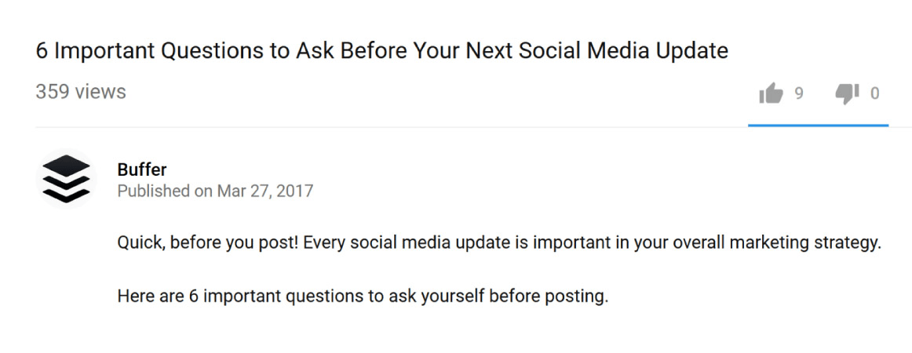
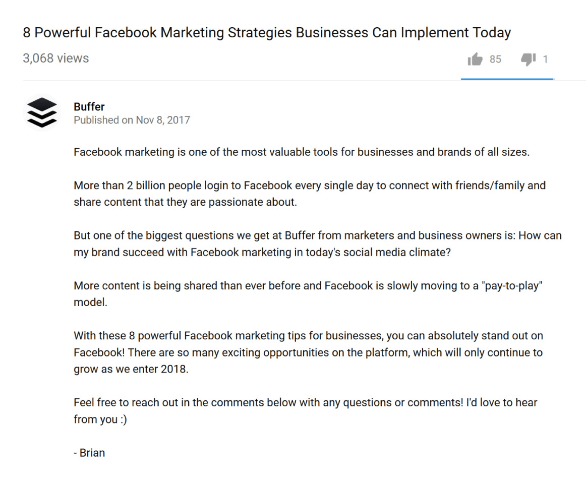

Having great content is important, but it’s not all. You must also consider writing a good title, description and add relevant tags and not too many.

<!--endintro-->

It is not very difficult, but you should still follow some rules:

### 1. Write titles designed to maximize CTR (Click-Through Rate)    

The more people click on a video, the more it will be promoted on YouTube. Use power words such as "proven", "powerful", "hack", "effective", "guide", "technique"... Also, use brackets and parentheses. You also want to include your main keyword in your title, ideally at the beginning. The structure of your title could be “keyword + value proposition” (e.g. "Digital Marketing: 10 proven tips to increase your website traffic"). Try to stick to 55-60 characters for your title. Also, include the current year in your title (ideally between brackets or parentheses).

### 2. Write keyword-rich and SEO-friendly video descriptions

[YouTube officially recommend long descriptions](https://www.youtube.com/watch?v=gTrLniP5tSQ&feature=youtu.be) (up to two paragraphs). Treat it as a mini blog post, giving users detailed information about what to expect. Consider writing between 100 and 200 words. Explain what the video is about but don’t give all the details. People still need to see your video after reading the description. If you would like to insert external links (leading to a landing page, social media, etc), do not insert them at the beginning. 

  ::: greybox
  **Note:** When adding links to your video description, copy the **full URL** you want to link to, and then paste it into the YouTube video description box. You should include the "https://" so the links are clickable.
  :::

Remember the first few words of your description also appear in Google results so don’t waste them: write about the main topic of your video. Add external links at the bottom of your description otherwise, you might look like a bit “clickbait”. Moreover, you want viewers to stay on YouTube and not leave to an external website (your video should make people stay on YouTube, ideally on your channel/watching your videos). Note that YouTube is strict on clickbait titles. If people click on your video but don’t watch it, they will bury it.

::: bad

:::

::: good

:::

### 3. Optimize video tags

Use 3-5 tags that include their target keyword and close variations. Then use TubeBuddy, enter target keyword into the “Tag Explorer” feature, then use relevant tags given by TubeBuddy. Eventually, spy on the tags used by other videos. This “competitor analysis” can help search engine rankings but also help your video show up next to competitors as a suggested video. Remember tags are meant to make YouTube understand what your video is about. Too many tags would, therefore “confuse” the search engine (both Google and YouTube). Don’t use too many tags (about 5) but make them very specific. The first tag should be your keyword and then add 2 or 3 variations (use YouTube search suggestions) and then add an extra broad tag to add context. 

### 4. Say your keyword in your video

Nowadays, Google (and therefore YouTube) can “listen” to videos. As a result, changing SEO and keywords of an “old” video may result in this video to be demoted by YouTube as the audio does not correspond to the new SEO and keywords.

---

**Images:** [Courtesy of Brian Dean](https://backlinko.com/grow-youtube-channel).
