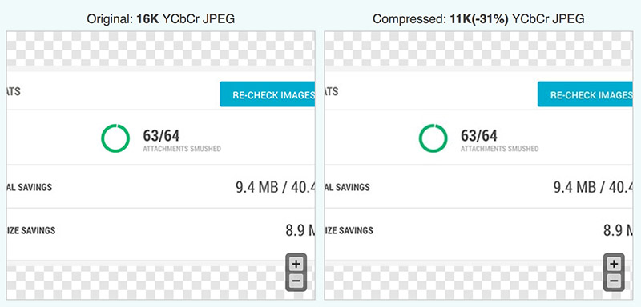
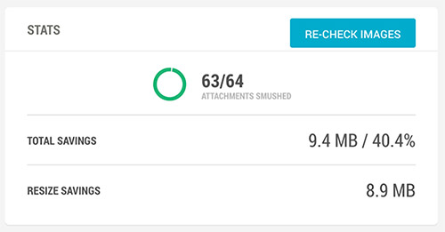

A nice looking image can be harmful to your website if it's not optimized. It's important to optimize images for the web because the fewer bytes the browser has to download, the less bandwidth the client uses, and the faster the browser can download and render your content on the screen.​ 
 <excerpt class='endintro'></excerpt> 

The first thing is to <a href=/do-you-know-how-to-save-your-graphics-in-the-right-format>save your graphics in the right format</a> ​and size. After that, you should run an image optimizer.  

Some tips and techniques to keep in mind as you work on optimizing your images: 
<ul><li> 
      <b style="background-color:initial;">Don't be afraid to dial down the "quality" settings</b> if the results are very good and byte savings are significant </li><li>
      <b>Remove unnecessary image metadata</b> like geo information, camera information, and so on.  </li><li> 
      <b>Use</b><b> automated tools</b> to ensure that all of your images are always optimized. E.g.: <a href="http://optimizilla.com/" target="_blank">http://optimizilla.com​ </a> 

   </li></ul><dl class="image"><dt>  </dt><dd>Figure: Optimizilla reduced the image below in 31% </dd></dl> 
<h3 class="ssw15-rteElement-H3">WordPress  </h3>
If your website is running on WordPress you should install and activate the plugin <a href="https://wordpress.org/plugins/wp-smushit/" target="_blank">WP Smush</a>. It scans every image you upload – or have already added to your site – cuts all the unnecessary data and scales it for you before adding it to your media library.  
<dl class="image"><dt>   
   </dt><dd>Figure: WP Smush plugin saved 9.4MB from one web site</dd></dl>

