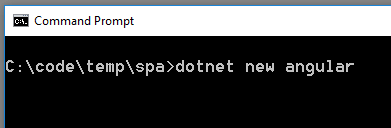
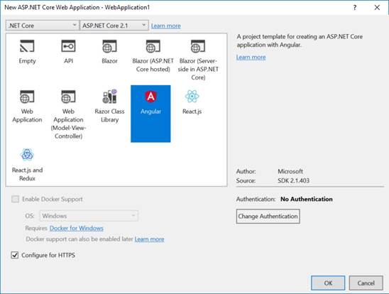
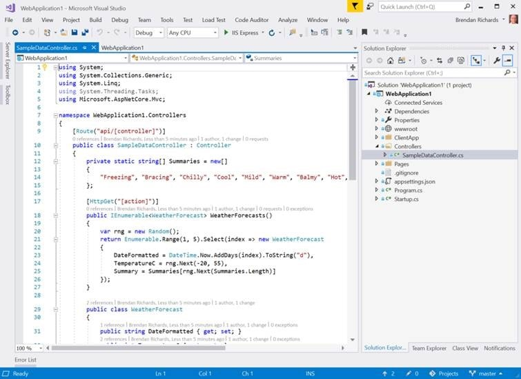
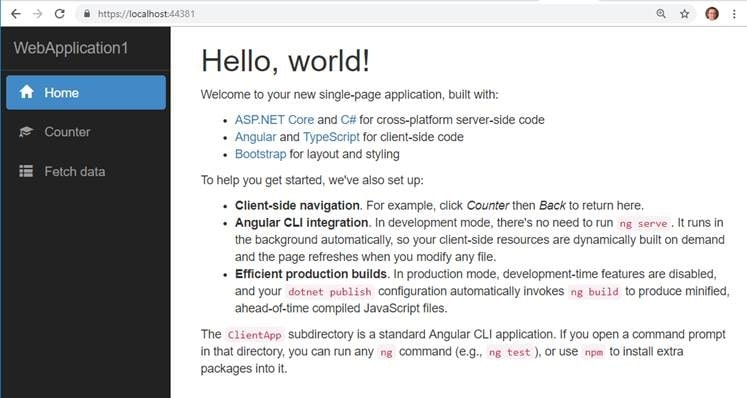
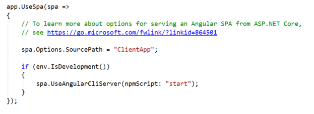

**For .NET Developers only!**

For many Angular solutions, a good practice is to keep your client-side and server-side code in separate projects.

* You get a clear separation of concerns
* You usually expect your server-side stack to outlive your client-side technologies
* You may plan to use your WebAPI with multiple user interfaces such as mobile or bots
* Easier to deploy your angular app to a CDN

<!--endintro-->

For some solutions, it might be simpler to integrate your client-side and server-side into a single project – and with the SPA templates for ASP.Net Core, this has never been easier.

* A single project might make sense for a smaller, simpler solution
* There will be only one website to deploy to a single web server that will serve both angular and WebAPI sites
* The project can be built with a single build process
* This might be a good choice if you are looking to migrate an existing MVC website as you can host MVC pages and the Angular app under one site
* This approach is easier if you want to use Windows Authentication
* No CORS configuration required

To create an Angular application with the SPA template new project from the command line or you can use Visual Studio. From ASP.NET Core 2.1 onwards, this template is included.
<dl class="image">&lt;dt&gt;&lt;/dt&gt;<dd>Figure: Creating a project from the command line</dd></dl><dl class="image">&lt;dt&gt;&lt;/dt&gt;<dd>Figure: Creating a project using Visual Studio  </dd></dl>
Although Visual Studio can be used to create the project, we still recommend Visual Studio Code for working with the Angular code, as per [Do you know the best IDE for Angular?](/_layouts/15/FIXUPREDIRECT.ASPX?WebId=3dfc0e07-e23a-4cbb-aac2-e778b71166a2&TermSetId=07da3ddf-0924-4cd2-a6d4-a4809ae20160&TermId=481b8d76-c2aa-4452-954a-26bb11628ba0)

###     The ASP.NET Core SPA Template for Angular Includes: 
<dl class="image">&lt;dt&gt;&lt;/dt&gt;<dd>Figure: A simple example WebAPI</dd></dl><dl class="image">&lt;dt&gt;&lt;/dt&gt;<dd>Figure: An Angular UI with Twitter Bootstrap styling</dd></dl><dl class="image">&lt;dt&gt;&lt;/dt&gt;<dd>Figure: Server-side configuration in Startup.cs allowing the Angular UI to be hosted from under the single ASP.NET Core website</dd></dl>
This Angular app uses the Angular CLI and is fully compatible with any other Angular CLI app. If you want to create a new app from scratch, simply delete the contents of the  **ClientApp** folder and run  **ng new.**

So you get the benefits of easy client-server integration without having to compromise any Angular client-side features or Angular CLI tooling.
