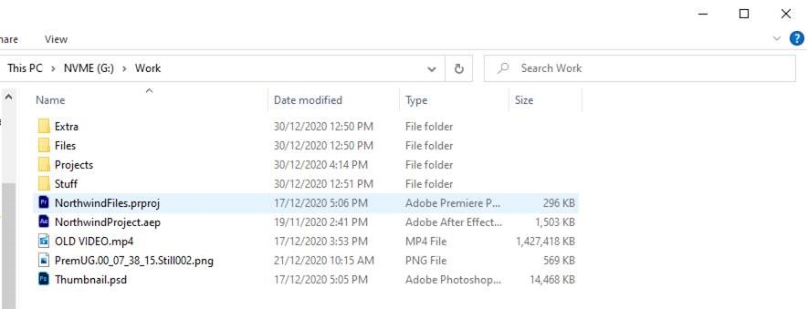

It is important to back up your work regularly to a separate location to prevent any loss of data. Ideally, back-ups are saved to a server or cloud-based file storage for ease of access.

When building projects, ensure that files and folders are labeled clearly. For example, use different folders for different file types - footage, images, exports, and projects, etc. This ensures that another team member (or your future self) can easily find all the assets associated with the project. File names and structure should be consistent – both among team members and over time.

<!--endintro-->

::: bad  
  
:::

::: good  
  
:::

A good file structure should also include storing finished projects separately from the working files. In a team environment, this system can also incorporate file ownership with different users.

::: bad  
  
:::

::: good  
  
:::

File names are also very important - they are the principal identifier of a file. They need to include information about the content and context of the file.

Always use version numbers when saving – don’t use the word ‘final’. It is much easier to follow the progression of a project with numbers, both to find the latest version or to revert back to a previous one if needed.

::: bad  
  
:::

::: good  
  
:::
