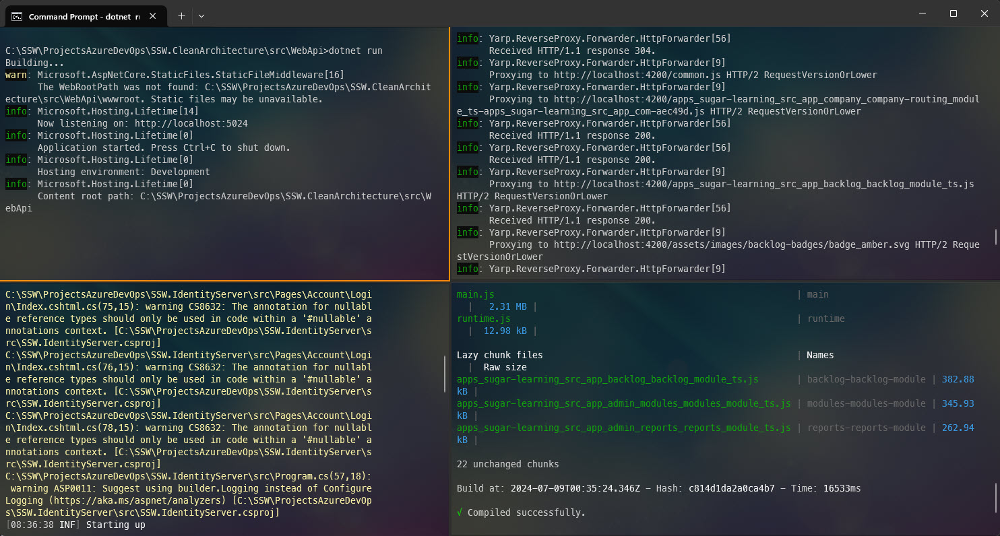

Windows Terminal is a modern terminal application that allows users to manage multiple command-line tools from a single interface. One standout feature is the ability to split the main window into multiple panes, enabling the running and viewing of multiple sessions side by side within a single window.

<!--endintro-->

This feature serves as an alternative to having multiple terminal windows open simultaneously. Panes help keep everything in one place, making it simpler to navigate between different sessions.

Use cases:

* Monitoring different processes simultaneously.
* Running multiple projects locally.
* Executing commands concurrently.

Main shortcuts:

* `Alt + Shift + +` to split the pane vertically.
* `Alt + Shift + -` to split the pane horizontally.
* `Alt + Shift + W` to close the pane.
* `Alt + Arrow` to move between panes.
* `Alt + Shift + Arrow` to resize a pane.

::: ok  

:::

::: good  

:::
