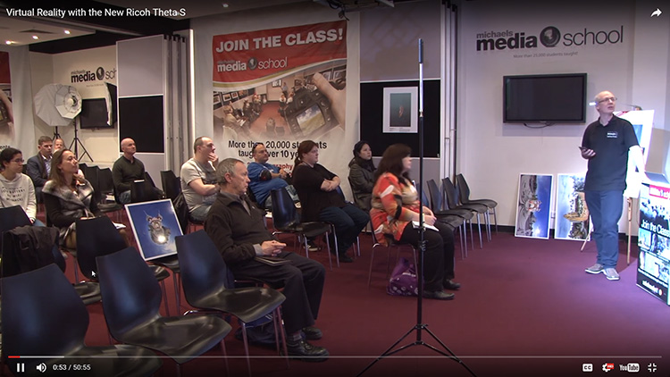
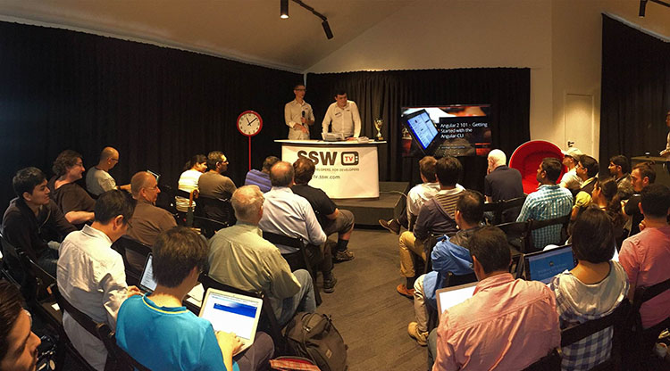

Audience shots are great except when you don’t have a full house. In this case you should move people to be next to each other.

<!--endintro-->

::: bad  
  
:::

::: bad  
  
:::

::: good  
  
:::

::: info
**Tip:** To ensure you get the best shot possible, fill seating from the front back. It's a good idea to use VIP signs and place them on the back row to prevent people sitting there initially. These can be moved later when all seats are filled at the front.

:::
