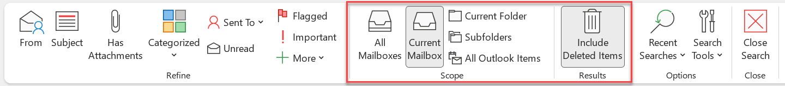

Being able to find an email quickly in Outlook is an important skill, and many of the following techniques will also help you in your Google searches too.  

<!--endintro-->

## Search Scope

Restricting the scope of the search (i.e. where you are searching) can be a great way to limit the number of results to make them more manageable.

* If you start a search from your Inbox, the default uses Current Mailbox (i.e. all of the folders in your mailbox), but you can restrict it to just your Inbox by clicking “Current Folder”.
* If you start the search from a more specific folder (e.g. Deleted Items, Junk, or Sent Items), the default uses Current Folder.

## Syntax

There are some syntax tricks that are usable in Outlook as well as Google, and these should be used often to hone down the number of results so you can find what you need.

* – (“dash” symbol)

  * To remove irrelevant items
  * E.g. jobs -apple
  * Tip: Start with a broad search, and then, when you start seeing irrelevant results about invoicing, add -invoice to your search.
* “” (“double quotes” symbol)

  * To specify these words one after the other in this order
  * e.g. “Smith James” will not find James Smith
  * Useful when using common words but you know they were written in an exact phrase. E.g. “on top of this”
* OR

  * To give alternatives that may exist in the email you’re trying to find
  * E.g. truck OR lorry
  * Tip: Must be upper case… lowercase “or” won’t work

## Outlook Specific

Email has plenty of metadata that can be sifted through to find the right one, and many of these are available from the ribbon.

* Subject:
   * If you know a word was in the email subject
* From:
   * If you know who the email was from
* To:
   * If you know who the email was to
* CC:
   * If you know someone specific was CCed
* hasattachments:yes:
   * This is often useful when you’re looking for a particular attachment, rather than the email itself
* attachmentcontains: 
   * The contents of PDFs and Word docs are indexed too, so you can specify a word or phrase that exist in the attachment to help you find it
* received>1/1/2020: 
   * To limit the results to only a particular time period