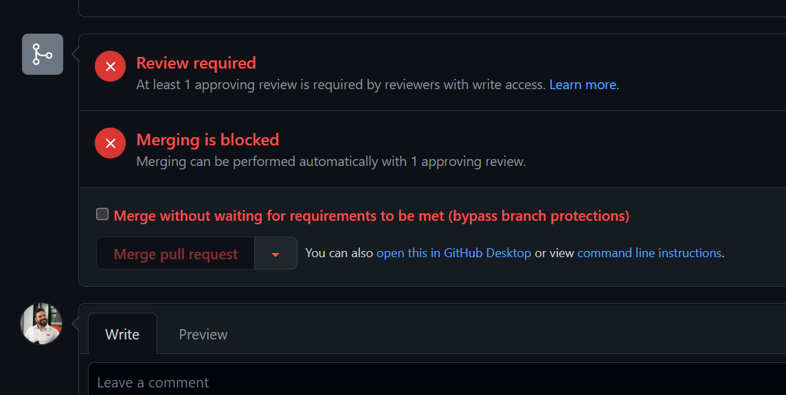

You should be using [branch protection](/use-branch-protection) rules to protect your main branch in your source repository. These can include minimum number of reviewers, specific required reviews, passing tests, or code quality checks. These help you maintain quality standards in your product, but you can override these checks with a privileged account and, sometimes, you should.

<!--endintro-->

Most source code repositories (including Azure DevOps and GitHub) allow you to set branch protection rules, meaning code must meet a set of conditions before it can be merged into the main branch. But administrators, or individuals with the appropriate delegated authority, can bypass these checks and merge code without these conditions being met.

### When SHOULDN'T you override branch protection rules?

Just because you hold the keys, doesn't mean that you should infer a license to merge code at your own behest when it overrides protections that have been put in place for a reason.    
    
For example, if a PR is blocked because a reviewer has requested changes, you shouldn't use your privileges to override the branch protection rules to avoid making the requested changes. Just like with any other privileged account, with great power there must also come great responsibility, and it's _your_ responsibility to use those privileges for the purpose they were granted, and not for your own convenience.

### When SHOULD you override branch protection rules?

While branch protection is an awesome feature and, when done right, can allow you to automate your review process and even [remove the need for human approvers](https://jeroenmols.com/blog/2022/02/23/pull-request-reviews/). But sometimes it creates a bottleneck that can present its own issues. One example might be if you need to merge an urgent fix to resolve a production issue. Another might be that you have a failed test runner, which could cause all of your tests to fail and block all pull requests.

### What to do if you have to override branch protection rules

Depending on the severity of the situation, you may need to act quickly. But you should **always** attempt to get authorisation from the Product Owner first, and [document it](/as-per-our-conversation-emails).    
    
The most important thing to do, though, is to [re-evaluate your processes](/do-you-evaluate-the-processes). On rare occassions you may find that overriding branch protection rules was a one-off necessity, but it will often also highlight a weakness in your processes.    
    
This doesn't necessarily mean a problem with the rules themselves (although of course it could). For example, if you have an urgent fix and your rules require at least one reviewer, but you can't find anyone to review your PR, you _may_ need to override the protection rules on this occassion. This _wouldn't_ highlight a need remove that protection rule, but it _would_ highlight a need to investigate availability of reviewers.    
        
Like any process involving privileged access, it's up to you to exercise your discretion, and use common sense to determine whether your privilege should be exercised, and whether exercising that privilege highlights a need for a change in process somewhere along the chain.
