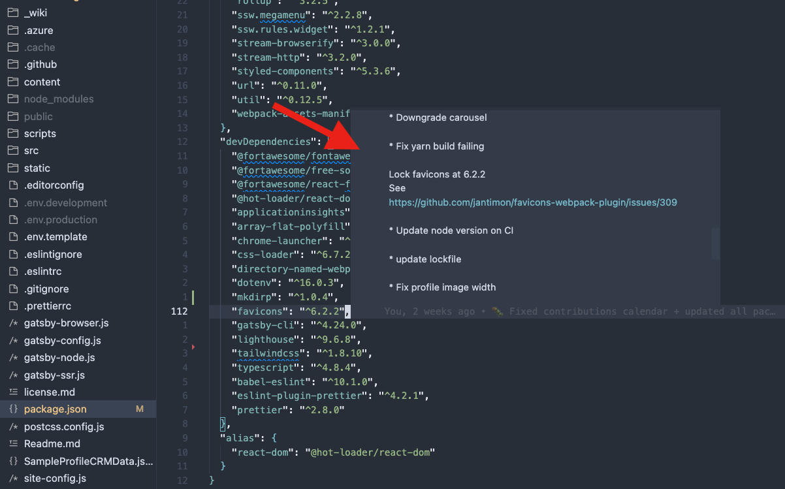

Packages are the lifeblood of any software project. However, if the team is not careful, that lifeblood can turn into a heavy weight dragging the application down. It's too easy for 10 packages to turn into 1,000.

That's why it's crucial to maintain a package audit log.

<!--endintro-->

A package audit log helps developers track why packages are added, who added, and who approved them.

## What to track?

There are lots of things that can be tracked in a package audit log. Generally, you want to keep it as simple as possible and contain only information that isn't easy to find elsewhere. For example, bundle size and load time can easily be found on [Bundlephobia](https://bundlephobia.com), so there is no need to track that.

Some developers keep track of minimal information such as:

* Name
* Link to npm/NuGet
* Why (the reason this package version was chosen)

While others keep track of maximum information such as:

* Name
* Link to npm/NuGet
* Action (aka "added" or "removed")
* Actioned by
* Approved by
* Why (the reason this package version was chosen)

If you go with the maximum information, this smells like Technical Debt. However, it does provide an easy way to find out where the package is, who was involved in adding or removing it and why the change was made.

## Options for Tracking Packages

Managing NPM packages is a difficult task, especially when some packages require a certain version to work with the rest of your project or were added for a specific reason.

There are 4 different options that you could take:

* Option 1 - Log the information in Technologies-and-Architecture.md
* Option 2 - Make good commit messages
* Option 3 - Leave comments in package.json
* Option 4 - Option 2 and sometimes Option 3 (✅ Recommended)

### Option 1 - Log the information in Technologies-and-Architecture.md

Markdown provides an easy way to format package log information, so one way of storing it is in Technologies-and-Architecture.md

Alternatively, you could keep track of this information in a different file for each project in the solution. e.g `\FrontendPackageAuditLog.md` or `\BackendPackageAuditLog.md`

Pros and Cons:  
✅ More descriptive notes about the package  
❌ Hard to keep up-to-date  
❌ Tech Debt  

It's imperative that the package audit log is updated every time a package is added or removed. So, add it to the Sprint Review as an item to action every week. That way, the team is aware of all changes, and any missed changes are caught.

This process could be taken even further by having automated checks in PRs to add package details and then generating release notes based on those PRs.

::: greybox
## Project Northwind Frontend (React)

These are all the packages that have been added to the project (ordered by most recent).  
**Note:** Statistics like load time and bundle size can easily be found at [Bundlephobia](https://bundlephobia.com/)

### [font-awesome](https://www.npmjs.com/package/font-awesome)
* Action: ✅ Added
* Actioned by: William Liebenberg
* Approved by: No one available 😥
* Why: Get pre-made icons in our app!

### [date-fns](https://www.npmjs.com/package/date-fns)
* Action: ✅ Added
* Actioned by: Piers Sinclair
* Approved by: Adam Cogan
* Why: It's faster than moment

### [moment](https://www.npmjs.com/package/moment)
* Action: ❌ Removed
* Actioned by: Piers Sinclair
* Approved by: William Liebenberg
* Why: It's slower than date-fns

### [bootstrap](https://www.npmjs.com/package/bootstrap)
* Action: ✅ Added
* Actioned by: Brady Stroud
* Approved by: Piers Sinclair
* Why: For pretty styling on the application
:::

:::bad
Figure: Bad example - Packages documented in Technologies-and-Architecture.md
:::

### Option 2 - Make good commit messages

Commit messages are an easy way for devs to add information about package updates/changes without the need to go out of their way.

So putting your package audit information into your commit messages is another option for storing it.

Pros and Cons:  
✅ Easy for the dev  
❌ Message could be overwritten by a more recent commit  
❌ Not as easy to read (have to hover over it to read)  

:::ok

:::

### Option 3 - Leave comments in package.json

Having comments in package.json is an efficient way of getting important package information across to other developers without the need for them to go to other files.

Pros and Cons:  
✅ More descriptive notes about the package  
✅ Notes are documented together with the package  
❌ Can cause noise and clutter within package.json  

:::ok

:::

### Option 4 - Option 2 and sometimes Option 3 (✅ Recommended)

Creating commit messages and leaving comments in package.json both have their advantages but neither is perfect. By combining the two you can get the best of both worlds.

Leave a good commit message for every package change so that a developer can investigate it further and if there's something abnormal about the package then leave a comment so it's immediately clear to other developers.

Pros and Cons:  
✅ Low Tech Debt  
✅ Easy for the dev  
✅ Descriptive for the packages that require it  
❌ Not as easy to read (sometimes required to read into the commits)  

:::good

:::
