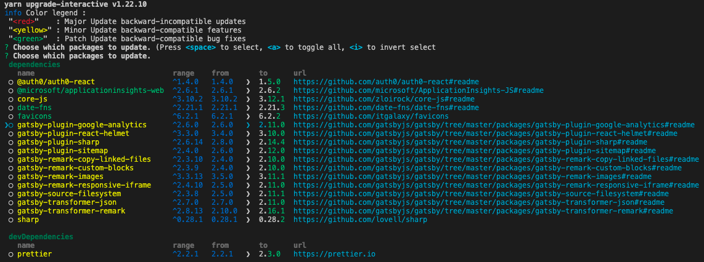

Npm packages often get new releases (adding new functionalities, fixing bugs or vulnerabilities). It is important to keep the packages updated as much as possible during the development of your application. The best way to do that is to update all the packages every time you add a new package to your application, and include the `npm outdated` and `npm audit` reports in the Sprint Review. These commands are also available with yarn with `yarn outdated` and `yarn audit`.

<!--endintro-->

`npm outdated` returns an overview of your packages: the version, the wanted version (the maximum version of the package that satisfies the semver range specified in package.json) and the latest version of the package.

 

-  **Red** indicates the package version is below the wanted version.
-  **Yellow** indicates the package version is at the wanted version but below the latest version.

`npm audit` returns an audit on your packages for vulnerabilities. It also provides information on how to resolve them.

To add a new package, use `npm install package-name` or `yarn add package-name`.

To update your packages, use `npm update package-name` or `yarn upgrade package-name`. Yarn also has a useful tool called `yarn upgrade-interactive` that allows you to see which packages are outdated, and upgrade them all at once.

**Note:** Use `yarn upgrade-interactive --latest` to see outdated packages with breaking changes.
