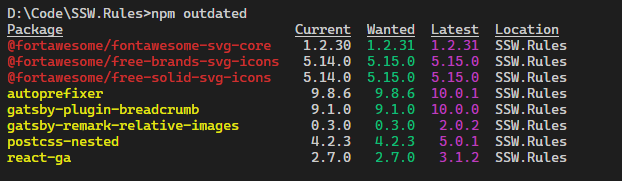
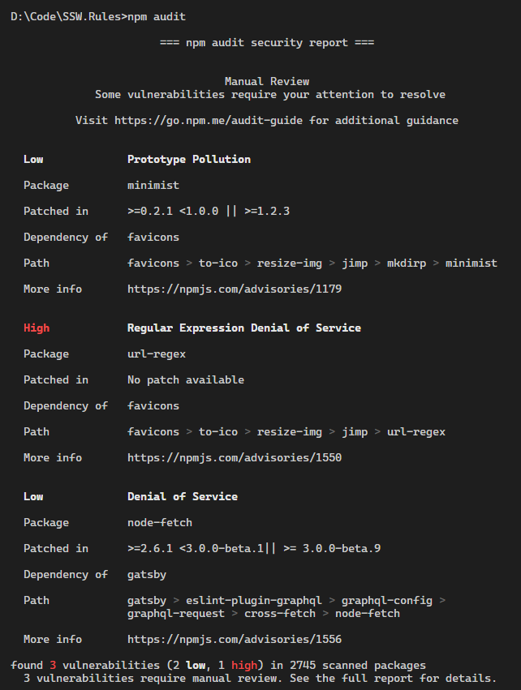

NPM packages often get new releases (adding new functionalities, fixing bugs or vulnerabilities). It is important to keep the packages updated as much as possible during the development of your application. The best way to do that is to update all the packages every time you add a new package to your application, and include the `npm outdated` and `npm audit` reports in the Sprint Review. These commands are also available with yarn with `yarn outdated` and `yarn audit`.

<!--endintro-->

```shell
# NPM
npm outdated
npm audit

# Yarn
yarn outdated
yarn audit
```

`youtube: https://www.youtube.com/embed/LN2zsrLqljY`
**Video: NPM package hell 🔥... How to avoid going insane with [Brook Jeynes](https://ssw.com.au/people/brook-jeynes/) (4 min)**

Running `npm outdated` returns an overview of your packages versions showing:

* The **current** version your project is using
* The **wanted** version, i.e. the maximum version of the package that satisfies the semver range specified in package.json
* The **latest** version of the package

The packages output from this command will also show up in different colours:

* **Red** indicates the package version is below the wanted version
* **Yellow** indicates the package version is at the wanted version but below the latest version



`npm audit` returns an audit on your packages for vulnerabilities. It also provides information on how to resolve them.



To add a new package, use:

```shell
# NPM
npm install package-name

# Yarn
yarn add package-name
```

To update your packages, use:

```shell
# NPM
npm update package-name

# Yarn
yarn upgrade package-name
```

Yarn also has a useful tool called `yarn upgrade-interactive` that allows you to see which packages are outdated, and upgrade them all at once.


::: info
**Note:** Use `yarn upgrade-interactive --latest` to see outdated packages with breaking changes.
:::
