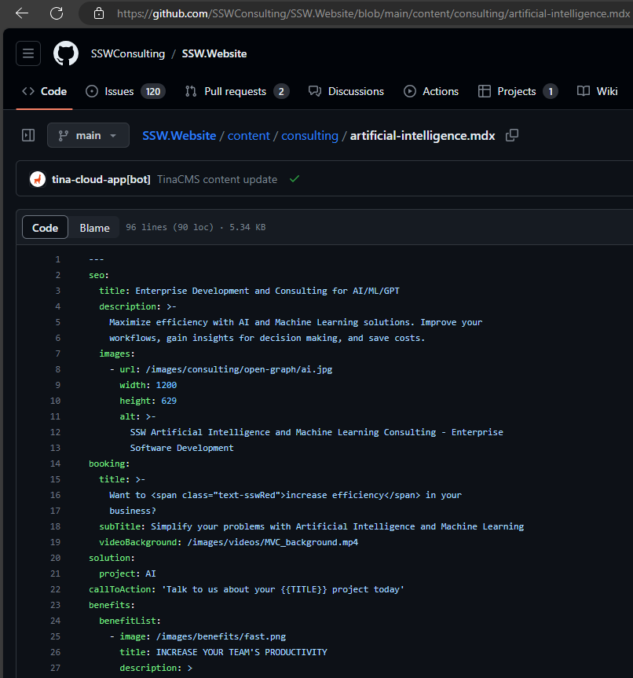

Managing webpages can be challenging, especially in projects with many contributors. When editing a page, a common problem is not knowing who the original author was. This is bad, because it's important not to change something that was there for a reason!

<!--endintro-->

The best way to solve this is by having a page owner for each webpage.

### Why?

A designated page owner ensures someone is responsible for the accuracy of the page content. It avoids confusion about who to approach for major changes, and it allows the page owner to keep an eye on changes.

### Steps
On GitHub:

1. Markdown files - Add an 'owner' field in the metadata of the markdown file for each page.
2. New pages - The field should be required when creating a page.
3. Pull requests - Automatically add the page owner as a reviewer for any pull requests that modify their page.

✅ The owner is aware of and can approve any changes
✅ People know who to consult about the page
❌ We don't use code owners for this because it blocks too many pull requests for minor edits
❌ Version history is not good enough - often the creator of a page is not the actual author e.g. a dev makes the page for a Marketing person

::: bad

:::
