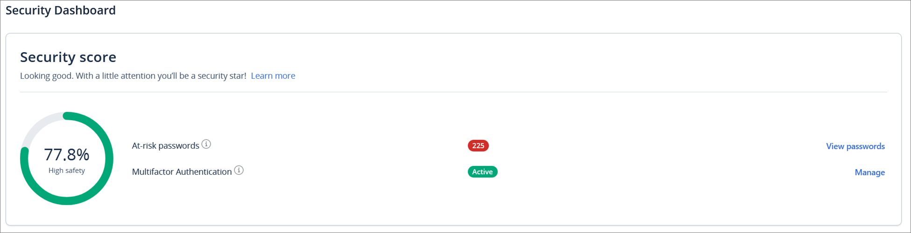
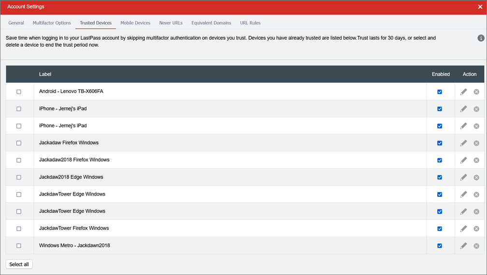
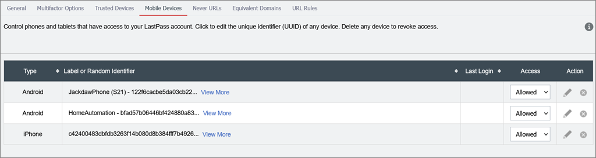

The best passwords in the world are the ones you can never possibly remember. Computer generated passwords, with a length of at least 16 characters, offer the most protection. A **strong password** look something like this:

:::greybox
$Jun!ZW@gYS%bmy0($34hYj&8hsgfDF
:::
::: good
Good example - A strong computer-generated password
:::

This is obviously not something you can realistically type in every time you need to use it. Fortunately, the same tools that generate these for us also manage them, storing them securely and automatically entering them into websites and apps for us.

With a password manager, you don't have to remember that strong, unique password for every website. The password manager stores them for you and even helps you generate new, random ones. 

<!--endintro-->

It does not matter which one. There are many great tools out there:

`youtube: https://youtu.be/xHSnHj-zKF4`

**Figure: Why you should use a password manager**

It does not matter which one. There are many great tools out there for example:

* **[Keeper](https://www.keepersecurity.com/enterprise.html)** - Enterprise level password manager.  Different groups of users can be given access to different passwords according to Business priorities.
* **[KeePass](https://keepass.info/)** - keeps all passwords in one database locked by a master key, which should be accessible only by the few people you trust.
* **[1Password](https://1password.com/)** - syncs passwords and personal data across all your devices. It's not quite as slick or capable as many competitors, but it's still an easy-to-use utility
* **[Keeper Password Manager & Digital Vault](https://keepersecurity.com/vault/)** - an elegant and security-first password management solution available for all popular platforms and browsers.
* **[Lastpass](https://www.lastpass.com/)** - matches the capabilities of other top paid password managers and is easy to use. Platform syncing limitations for the free version make it significantly less useful than it was
* **[BitWarden](https://bitwarden.com/products/)** - Take control of your online password security and manage private data safely from any location or device
* **[Dashlane](https://www.dashlane.com/lp/search)** - put passwords in their place, we’ll take care of them for you.

- - -

Some password managers provide a security score for a password - fix it if it’s a low number.

For example, in LastPass you can disable automatic device provisioning and you can manually approve them.
This way, a new device can’t get to your passwords even if your username, password and MFA got compromised at the same time. (in case a hacker manages to get into your phone and gets your password to LastPass).

