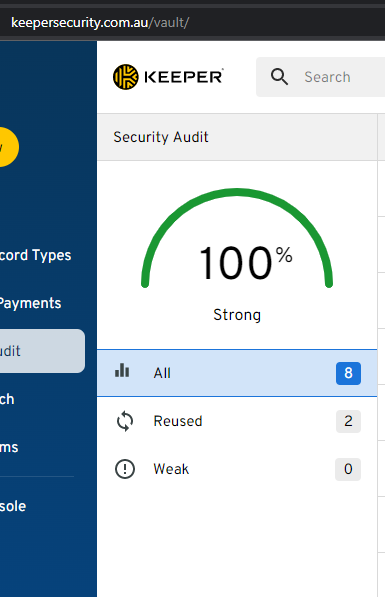

If you need to remember the password then a passphrase is best.  Preferably these should be made up of 4 random words with a length of at least 16 characters.  These eliminate the requirement for special characters and are incredibly difficult for a computer to guess.
A **strong password** would looks something like this:

:::greybox
correcthorsebatterystaple
:::
::: good
Good example - A strong memorable password
:::

However the best passwords in the world are the ones you can never possibly remember. Computer generated passwords, with a length of at least 16 characters, offer the most protection. A **super strong password** looks something like this:

:::greybox
$Jun!ZW@gYS%bmy0($34hYj&8hsgfDF
:::
::: good
Good example - A strong computer-generated password
:::

This is obviously not something you can realistically type in every time you need to use it. Fortunately, the same tools that generate these for us also manage them, storing them securely and automatically entering them into websites and apps for us.

With a password manager, you don't have to remember that strong, unique password for every website. The password manager stores them for you and even helps you generate new, random ones. 

<!--endintro-->

It does not matter which one. There are many great tools out there:

`youtube: https://youtu.be/xHSnHj-zKF4`

**Figure: Why you should use a password manager**

In an Enterprise you should use an Enterprise password manager

* **[Keeper](https://www.keepersecurity.com/enterprise.html)** - Enterprise level password manager.  Different groups of users can be given access to different passwords according to Business priorities.
* **[1Password](https://1password.com/enterprise-password-manager/)** - syncs passwords and personal data across all your devices. It's not quite as slick or capable as many competitors, but it's still an easy-to-use utility

- - -

You should use them for your personal security as well

* **[Keeper](https://www.keepersecurity.com/personal.html)** - 
* **[1Password](https://1password.com)** - syncs passwords and personal data across all your devices. It's not quite as slick or capable as many competitors, but it's still an easy-to-use utility
* **[Lastpass](https://www.lastpass.com/)** - matches the capabilities of other top paid password managers and is easy to use. Platform syncing limitations for the free version make it significantly less useful than it was
* **[BitWarden](https://bitwarden.com/products/)** - Take control of your online password security and manage private data safely from any location or device
* **[Dashlane](https://www.dashlane.com/lp/search)** - put passwords in their place, we’ll take care of them for you.

The best password managers provide a security score for all your enterprise passwords - fix them if they are low.

For example, in LastPass you can disable automatic device provisioning and you can manually approve them.
This way, a new device can’t get to your passwords even if your username, password and MFA got compromised at the same time. (in case a hacker manages to get into your phone and gets your password to LastPass).

