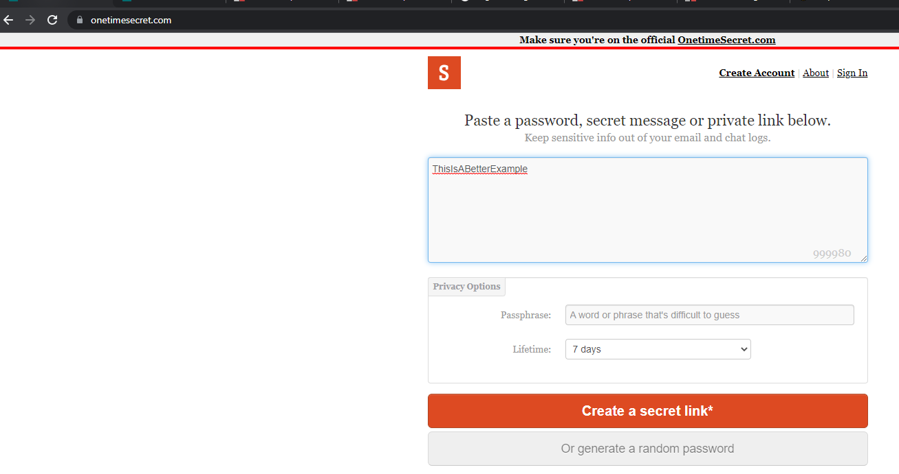

Often an organization needs to share a password to a 3rd party.  Perhaps a client or a vendor require a password. There are a few ways that this could be achieved but some are less secure than others.

<!--endintro-->

* **Email** - sending an email containing the username and password for anything is the worst thing you can do.  If that email falls into the wrong hands it is immediately compromised.

  :::bad
  
  :::

* **Email + SMS** - Sending a username via email and the password in SMS is slightly better but is still a little bit risky as both services could be compromised and often people sync their messages to their PC, so this is still too risky.

  :::bad
  
  :::

* **OneTime Sharing via a 3rd party** - You could use a service such as [OneTimeSecret](https://onetimesecret.com) to share the secret details. This is better but there is still a small risk that the 3rd party website could be compromised and your details are still leaked.

  :::bad
  
  :::

* **Share via your Enterprise Password Manager** - This is the most secure way to share a secret with an external 3rd party. With products such as Keeper Enterprise all of your  passwords remain safe inside your own vault and can generate a link or a QR code to send to your client.

  :::good
  
  :::
  
  :::good
  
  :::
