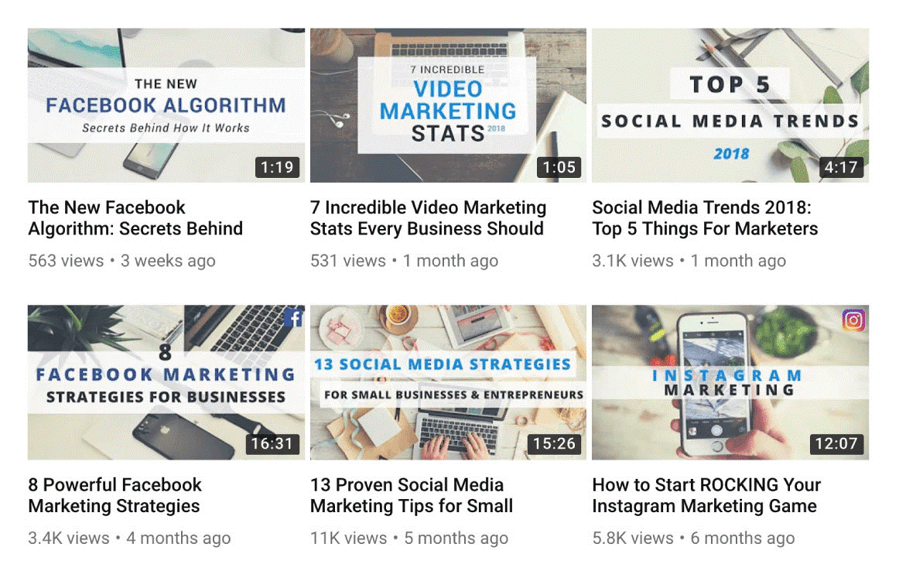

Thumbnails are a great way of telling your (potential) viewers what your video is about and why they should watch it. It is therefore important that these stand out from the others. 

 <excerpt class='endintro'></excerpt> 

A thumbnail can draw attention by:

<ul><li>Using bright colors and avoiding using the YouTube colors (white, black, red) so you don’t bend in.</li><li> Being custom (<a href="https://creatoracademy.youtube.com/page/lesson/thumbnails#strategies-zippy-link-2">90% of the best performing videos on YouTube have custom thumbnails</a>).</li><li>Using big bold titles (30 characters maximum, remember a thumbnail is small).</li><li>Feature your main keyword in the title</li></ul>
YouTube offers <a href="https://support.google.com/youtube/answer/72431?hl=en">resources to create better custom thumbnails</a> including image size and resolution, policies, etc. 
<dl class="ssw15-rteElement-ImageArea"> </dl><dd class="ssw15-rteElement-FigureBad">Bad example: despite looking "trustworthy", a thumbnail automatically generated from the video is not engaging enough. </dd>
 
<dl class="ssw15-rteElement-ImageArea"> </dl><dd class="ssw15-rteElement-FigureGood">Good example: a custom thumbnail looks professional and already gives important information about the content of the video.</dd><dt> </dt><dt><strong>Images</strong>: courtesy of Brian Dean (<a href="https://backlinko.com/grow-youtube-channel">source</a>). </dt>

