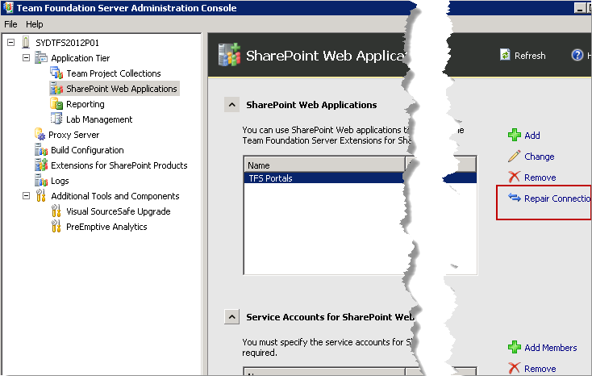

More steps will be required to integrate your SharePoint site and set up your Build servers. 

<!--endintro-->

After a TFS upgrade, you'll need to make sure your other servers are still integrated properly.

1. Check your Build servers. You'll need to upgrade the TFS installation on them and make sure they're set up correctly.
2. Check your SharePoint servers. You'll need to install the latest SharePoint Extensions and make sure you repair your SharePoint connections in the Configuration Manager of your TFS Server

